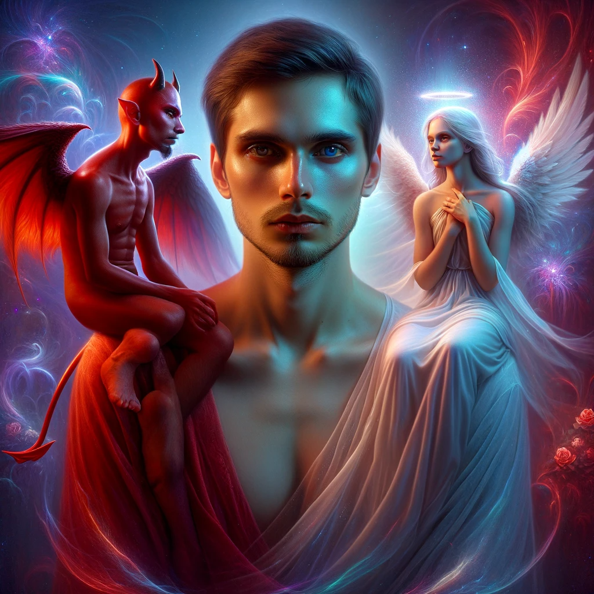

> _Be kind, for everyone you meet is fighting a great battle._ —Author unknown

> _For so long as the root of wickedness is hidden, it is strong. But when it is recognized, it is dissolved. When it is revealed, it perishes. ... It is powerful because we have not recognized it._ — The Gospel of Philip

What if nearly everything you're doing to "fight evil" is actually strengthening it — and moreover, what if part of you already knows this, but is actively concealing it from your conscious mind? What if the difficulty admitting this to yourself stems from the _very same mechanism_ that prevents the "bad people" from acknowledging the full implications of _their_ actions?

These are provocative questions, but they point to an astonishing truth — one that is excruciatingly painful yet ultimately liberating. The Devil hides in the very last place you would ever look.

---

Take a moment to reflect on what's wrong with the world, and bring to mind the people responsible. Don't they seem _fundamentally morally defective_? Do you feel contempt or maybe even malice? It feels like those emotions are there to help you _fight_ evil, but this is a sinister lie. They only to help you _darken_ the world while making you feel flawlessly convinced that you're helping.

This is not something I can convince you of, so I won't even try. But here's the thing: part of you already knows it. You don't enjoy mocking or shaming your enemies to help them (or anyone else) "see the light," or to make the world a better place. You do it to make yourself feel superior. It may temporarily suppress their misbehavior, but it _will_ increase the net hostility and polarization in the world. You may tell yourself that it won't, or that it's their fault if it does, or that the benefits outweigh the drawbacks, but part of you knows that these are just lame excuses for malicious behavior. This is true of _all_ forms of unkindness. This example is just one among countless.

This isn't an attack on you, though it may feel like one. That defensiveness is hiding something crucial — something that I promise you want to see. An aspect of your mind is actively preventing you from consciously acknowledging the effects of your words and actions. Why? 

Part of you _knows_ that darkness exists within you, and does everything in its power to shield this horrifying truth from your conscious mind. It makes you hyperfocus on the faults in others, because viciously attacking _their_ evil takes attention off of your own. Said another way: something within us _needs_ other people to be "bad," so that we can know ourselves as "good" by comparison. So we subconsciously do things to _provoke_ evil in others while convincing ourselves this is righteous.

---

     

Think back to a time when you disobeyed your conscience, pretending either that you couldn't hear it or that you could safely ignore it. We've all done this. When this happens, a schism is created in your mind: part of you knows _perfectly well_ that you're doing wrong, but that knowledge is cleverly shielded from conscious self-reflection. It is then easy to convince others that you _don't_ know, because you have convinced _yourself_. **All evil relies on this mechanism of self-deception**. We see it easily in others, but in ourselves only when it's convenient to our self-image.

Evil (almost) never _feels_ evil. That's the most terrifying thing. It's not until _after_ you wake up from this self-induced trance that you discover just how badly you were fooling yourself. People were even trying to _warn_ you, but in that grotesque state, you couldn't see what they were pointing at. In fact, the harder they tried to show you, the more you perceived _them_ as evil, crazy, or stupid — which only deepened your self-deceptive trance. But most horrifically of all, you see that some part of you always knew that you were doing wrong, even as you pretended not to.

     

---

This is where the "bad people" find themselves. Something in them is shielding the _wrongness_ of their behavior from conscious self-reflection — and the more contemptuously you judge them for it, the more they will perceive _you_ as evil and dig in their heels. You will take this as confirmation of _their_ evil, but they are actually recognizing the same self-deceptive mechanism in you that is operating within them – the very thing you see as "evil." **This whole sordid dance was choreographed by the darkness in _both_ of your minds, to perpetuate itself without either of you catching on.** You both come away feeling more than justified.

Something within you _wants_ to push people further into the dark, but doesn't want to be caught doing so. This is malevolent. People can subconsciously sense this intention, and this by itself is enough to provoke the darkness in their minds. Mission accomplished; more darkness was created without you having to do anything provably evil. All it took was your dark motivation — something that you can trivially deny, even to yourself. It is this dark pattern that "good people" employ to maintain their self-image. _Genuinely_ good people are those who have learned to stop doing it. They _never_ look down on others, because this is the surest sign of brewing self-deception.

The reason that the "bad people" need to shield their misbehavior from consciousness is that _part of them doesn't want to be doing wrong._ This means that they are not _fundamentally_ defective. We perceive their badness as intrinsic only to justify our contempt, which in turn exists only to create more. You don't have to take my word for it, but can actually learn to perceive this. If you manage to take your own self-deception mechanism offline for even a moment, it feels exactly like you'd imagine feeling if you were suddenly freed from a demonic possession. You clearly perceive how this "demon" has very cleverly commandeered people's minds.

To be fair, there does seem to be a tiny percentage of people who have consciously welcomed the demon in, for whom the description "evil" really does capture something important. Such people pose a unique challenge. Being "kind" to them in the conventional sense can indeed be dangerous. And yet the very _deepest_ aspect of their mind does not want it. Again, it is only once you see exactly what "it" is that you understand why _nobody_ ultimately could. Think of it like a form of Stockholm syndrome. If you want to defeat evil, you must want them to be free of it, too.

When we meet (or even hear about) such people, we often experience the overwhelming urge to hate them, but this is the ultimate trap. It is their darkness inviting ours to treat them in a way that will drive them further into its clutches — and we very often take the bait. How could we not? It is like a gift-wrapped present: the opportunity to manifest our darkest tendencies in a way that we can convince ourselves and others is unmistakably _good._ 

Seeing this all clearly turns your whole world upside-down. We are hating people for their susceptibility to the world's most fiendish mind-virus — the one responsible for our very hatred. **Any time you feel contempt for _anyone_ for _any reason whatsoever_, your mind is secretly gearing up to elevate or otherwise enrich yourself at the world's expense.** We are all hypocrites, and contempt is _always_ a sign that your mind is hiding some hypocrisy from yourself.

Until this becomes _common knowledge_ (in the [technical sense](https://plato.stanford.edu/entries/common-knowledge/) — where everyone knows that everyone knows that everyone knows...), humanity will continue to tie itself up in horrifying knots while pretending to be freeing itself from them. (This is exemplified by "pseudo-kind" ideologies, in which people claim to be helping one person or group by demonizing another. This *always* triggers a counter-ideology, and not by accident.) Unfortunately, our self-deception prevents us from making this _common knowledge_, no matter how clearly it is pointed out. This piece is an attempt.

---

What happens when your self-deception mechanism to "goes offline"? 

Your whole carefully-constructed reality — and the hierarchy of blame that scaffolds it — suddenly comes crashing down. The "great battles" that others are facing suddenly become obvious, as does your unfortunate role in having perpetuated them. It is impossible to communicate how painful the full epiphany is — to see what a hypocrite you've been; to be forcefully shown just how much of the world's darkness can be traced back to your own decisions to be unkind. But it's not all gloom and doom.

You then perceive your profound interconnectedness with the world. Malice, contempt, and self-righteousness are recognized as profoundly delusional. Seeing how confused people actually are, it is impossible to feel a trace of ill-will. You remember the sense in which you are not fundamentally better (or worse) than anyone, and why pretending that you are always makes the world darker. You feel boundless love for all of reality, recognizing your inseparability from every particle of it.

This perspective is not an altered state of consciousness, but something that is always there yet somehow curiously hidden. It feels like coming home to a place you never left. It is your deepest and most natural mode of knowing, which is how you will know that you can trust it.

---

There, you see that the root of the problem was the desire to be special; what the Buddhists call the _ego_. For those of us with a self-image as "good people," this manifests as the need to be _relatively_ good; i.e., good in comparison to others. This duality forces us to continually create "bad people" in all sorts of subtle ways that we can't consciously recognize. This process only comes to an end when we discover the _absolute_ good within.

This "absolute good" is something that we cannot take any credit for[^credit]. Instead, we can only feel profound gratitude for whatever grace allowed us to discover it, and heartbreak that it still remains so deeply hidden in others. The hardest part is watching the whole world being casually cruel to each other, unaware of which "team" they are secretly fighting for. It inspires a fierce determination to end the "possession" that has captured people's minds, instead of deepening it like we've unwittingly been doing. We clearly see the face of our true nemesis for the first time.

This doesn't mean that you will suddenly become nice or lovey-dovey toward evildoers. You may still need to be fierce, or perhaps even violent[^dalai-lama-gun]. Mockery, shaming, or even _apparent_ contempt might still be useful tools in your arsenal. But these will be in the service of _freeing_ people from the darkness, not pushing them further in. It is a kind of "tough love," and feels _nothing_ like the self-righteous antagonism that we normally feel when "fighting evil." You are still "connected to your heart." **That is what is most crucial.** Others can sense the profoundly benevolent intent (even if only subconsciously), and it makes _all the difference in the world_.

In every interaction you have two options: to either encourage the Light in others, or to fight their darkness with yours. **Encouraging their Light has nothing to do with being _nice_**. It is about being completely unwilling to abandon your own Light under _any circumstances_ — including the one that their darkness is presently testing you with. Their darkness is looking for a "hook" in your mind that it can use to justify itself — some sign that even you, the "good person," are weak to its seduction. If you refuse to abandon your integrity even then, the fierceness of your Light subjugates their darkness. They subconsciously remember that _the Light_ isn't just a myth.

This is authentic kindness (aka compassion). It is "radical" for two reasons. First, it contradicts our usual intuition that some people "deserve" it while others don't. It could never be the case that some people deserve to be shoved further into the abyss while others deserve to be freed from it. Second, it need not look anything like "kindness" in the conventional sense (though most often, it will). It certainly doesn't have to be soft or weak.

     

I know it feels like some people don't _have_ an inner Light to encourage, but this is just an illusion that our darkness uses to get its foot in the door. By the time it has tricked us into dividing the world into fundamentally "good" and "bad" people — which feels like the most natural thing in the world — it has already infected the deepest aspect of our minds. Then, it can bide its time fostering conditions that will get us to commit unspeakable horror in the name of "good."[^genocide]

---

> _And no wonder, for even Satan masquerades as an angel of light._ —2 Corinthians 11:14

It is said that "the elites" are tricking us into hating each other to take attention off of themselves. Doesn't this make you hate them? Could it be that there is an even more subtle and wicked puppetmaster that is tricking us into hating _them_, so that we never discover _it_?

Indeed there is. No matter how much power the elites wield, it is _nothing_ compared to that of the dark entity pulling even their strings.

     

You know the classic image of the angel and devil sitting on our shoulders? It's _almost_ accurate, except for two things. First, the angel isn't external to you, but represents your intrinsically compassionate nature. Second, the devil _is_ extrinsic; it is a kind of parasite. But it doesn't just whisper obviously-bad ideas in your ear; it alters your very perception and pretends to _be_ your inner angel.

     

It is this devil that tricks you into seeing other people as _fundamentally_ defective, instead of seeing that they are being manipulated by _their_ devils (which is something that your angel can always see). Our devils continually trigger each other — not because they are enemies, but _because they are allies_. Evil never actually fights evil; it only pretends to, to create more of itself.

     

You know how people sometimes suspect that there's an "evil global conspiracy" lurking in the shadows, running the show behind the scenes? They are not crazy. They are subconsciously sensing something genuine: there is indeed an aspect of all of our minds communicating with itself beneath our conscious thresholds, shielding itself from discovery in _insanely_ clever ways. Its greatest trick is to prevent us from suspecting, let alone detecting, our own role in keeping it alive.

Our individual devils are working together almost like a single "distributed organism" — the _Devil_, if you will. Each of us suspects its existence, but we all view it from different angles. No two people fully agree on who's ultimately pulling the strings of the evil plot. The truth is that _nobody_ is — and _everybody_ is.

     

This "dark entity" continually drives humanity toward various kinds of Armageddon: situations in which everyone is violently expressing their own righteous fury to defeat the darkness "out there." It is why the US is headed toward civil war without anyone suspecting their own complicity, and explains bitter [divorces](https://www.gottman.com/blog/this-one-thing-is-the-biggest-predictor-of-divorce/) in which each side feels like the exclusive victim / hero. Nearly the whole world is caught in its terrible sway, evil provoking "righteous" retribution at every turn, without anyone ever noticing the true source of it all.

This is not just a wacky theory, or just a metaphor. As best I can tell, everyone who introspects carefully enough eventually discovers this. Something within your very mind is conspiring with the darkness in others to produce a kind of Hell on Earth. Every time you feel contempt for _anyone_, your "devil" is reaching out to give theirs a kind of secret handshake; a sinister agreement to keep this world bound in darkness. I have used the word "subconscious" to describe this activity, but that's not quite accurate. **It is completely accessible to consciousness, if you know how to look.** It is something you are _doing._ [The Devil hides in the last place you would ever look](https://www.youtube.com/watch?v=gg8JYYyWSPg); the innermost chamber of your mind.

It is impossible to overstate the shock of discovering, for the first time, that you have _always_ been in on the "evil global conspiracy." It is terrifying, heartbreaking, and humbling all at once. Every single act of unkindness we've ever perpetrated has been in the service of the Beast, even when we told ourselves that we had "good intentions." This includes not only being cruel to other people, but _all_ acts in which we skirt our conscience — such as when we "shave off a little extra" for ourselves at the expense of others, or take pleasure in others' suffering, or countless other "innocent" misbehaviors. Every time we do this, we are strengthening each other's demons.

To be clear: there are surely groups of particularly "endarkened" people who consciously conspire to cause great harm, and **we must hold such people accountable** — but when we do so with contempt, we are secretly (and on a subconscious level, _knowingly_) reinforcing the very conditions that effectively compel their existence. They cannot be defeated without our seeing this.

     

Ironically, we have no leg to stand on if we're still feeling self-righteous, because that is the surest sign that we are still under the demon's malevolent sway. This is precisely the opposite of what that emotion tells us — that the more we feel it, the more _free_ of evil we must surely be. It is actually impossible to fight evil from this place, because self-deception can only ever create more of itself.

Our true enemy is not other people, but the dark "entity" that has captured _all_ of our minds. By keeping our attention fixated perpetually outward, it ensures that we never introspect deeply enough to discover our own complicity in keeping it alive. We _must_ learn to perceive this.

We each have a crucial role to play in bringing down the "global conspiracy," and it begins by rediscovering our Light.

---

MLK once said:

> *Darkness cannot drive out darkness; only light can do that. Hate cannot drive out hate; only love can do that.*

These words are far wiser than we know. Ultimately, evil is not actually a _presence_ (like it seems), but an _absence_. The absence of what? Of the perception of the interconnectedness of all Life; of our fundamental equality with others. That this absence can behave so much like a presence — and an _intelligent_ one at that — is astonishing.

In a profound and surprising sense, [you _are_ the world](unity.md). Ultimately, all self-deception boils down to ignorance of this fact. This ignorance is not fully dispelled until _enlightenment_, but we can all sense it at all times. It is why certain literature speaks to us so loudly, and why we sometimes thank strangers for acts of charity that don't seem to benefit us directly. Part of us knows that what happens to the world ultimately happens to us. It is senseless to scorn people for not having realized this.

It is not possible to reduce the darkness in the world by withholding our own Light; by leveraging our contempt[^contempt], malice, hatred, etc. That is an insidious trap that we _must_ see through if humanity is to survive. Your Light is capable of accomplishing everything you think you need your darkness for, and much, much more — but there is a price that must be paid: you must give up the illusion of being special; of being fundamentally different from the "bad people." You must relinquish the sinister pleasure of watching harm come to your enemies. In brief, you must give up self-deception.

In exchange, you will discover the path toward the world you actually want in your deepest heart of hearts. It is well worth the price, and infinitely more.

> *The shadow is a moral problem that challenges the whole ego-personality, for no one can become conscious of the shadow without considerable moral effort. To become conscious of it involves recognizing the dark aspects of the personality as present and real. This act is the essential condition for any kind of self-knowledge.* —Carl Jung

> *Such a man knows that whatever is wrong in the world is also in himself, and if he only learns to deal with his own shadow, he has done something real for the world. He has succeeded in shouldering at least an infinitesimal part of the gigantic, unsolved problems of our day.* —Carl Jung

     

---

> _Like many of you (I'm sure), psilocybin has changed the way I see this world, and the people around me. It has torn my heart open on many occasions and revealed to me how my actions effect other people in ways I would've never imagined. In addition, psilocybin has increased my ability to empathize with people to a degree I never thought possible._
>
> _I consider this a blessing, but it has also led me to a very troubling conclusion:_
>
> _The lack of compassion, empathy and love we (society) feel for each other is staggering. Especially between people who don't know each other. The more love and empathy I feel for others, the more aware I am of society's inability to feel it for each other._
>
> _Does this make sense? Does it mean this blessing is really a curse? Because sometimes, it feels that way._
>
> — A guy from [some online forum](https://web.archive.org/web/20150628081721/http://duncantrussell.com/forum/discussion/89/a-blessed-curse-psilocybinempathy/p1)

---

> *Nail on the head brother. My most recent mushroom trip (also the largest dose I've ever taken) I became fixated on a news story I had heard that week. About an 8 year old girl from a tribe in the Amazon, who was tied to a tree and burned alive in order to scare her people off their land so it could be logged. I realized that at the moment he did it, whoever lit that gasoline actually felt / thought more or less okay about what he was doing. **And my mind was illuminated with dozens of the parallels between that man's malformed, horrific perceptual / behavioral state, and mine. I saw the same mistakes in value attribution, the same willful ignorance of the consequences of my acts and words. And there was nothing I could do to deny the similarity.***
>
> *Reminds me of something (I think) Duncan [Trussell] said on some recent podcast, quoting somebody else: it isn't the victim of violence you have to pray for so much. It's the perpetrator. They are the one who is more trapped in delusion, more estranged from love, etc.*
> 
> (From a response)

## Addendum

(TODO)

- Judgement, outrage
- Pseudo-kindness
- Wisdom vs kindness

[//]: # (We _want_ people to believe that they're fundamentally broken.)

[//]: # (The most important thing needed in making a better world is freeing people from self-deception. We think that the greatest challenge is differences in opinions, but that's not true.)

[//]: # (Reveals empathy.)

[//]: # (Scaffold of blame)

## Footnotes

[^contempt]: Specifically, we mean (genuine) contempt for *people*. Contempt for ideas or behaviors can actually be healthy, as perhaps can (apparent) contempt that is rooted in genuine compassion.

[^credit]: In fact, taking credit for it is one way to be sure that we haven't found "it."

[^dalai-lama-gun]: The Dalai Lama was once asked what you should do if a gunman is trying to shoot you and you have a gun. [He said "shoot back."](https://www.snopes.com/fact-check/dalai-gun/)

[^genocide]: This is how genocides happen. The Nazis referred to Jews as 'vermin,' and during the genocide in Rwanda, Tutsis were referred to as 'cockroaches.' This is a common pattern throughout history. Perhaps paradoxically, the only way to be sure that you'd never do such a thing is that you don't feel contempt for the people who have.
