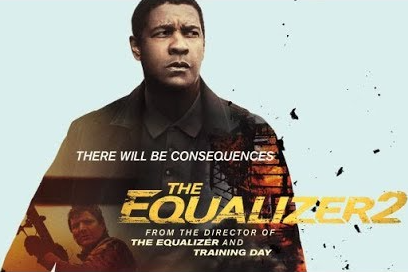
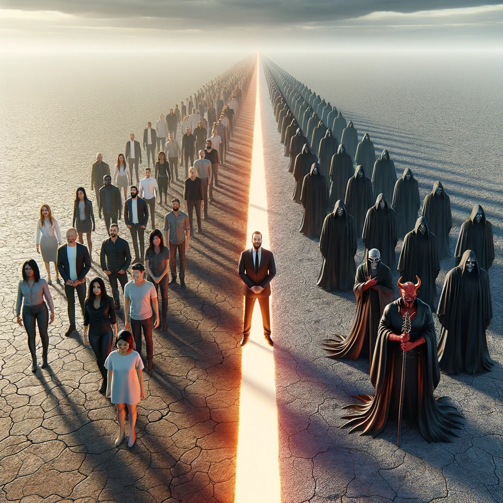
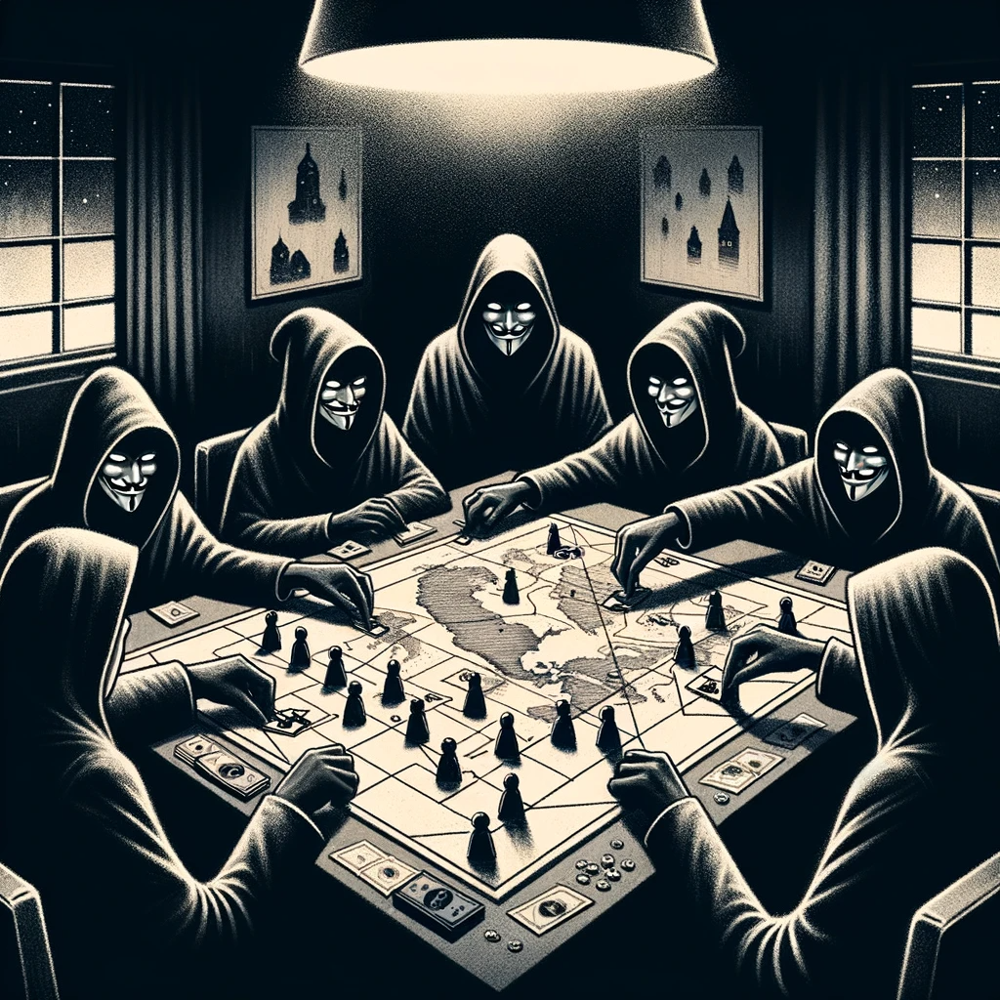

How do we not lose our hearts in the face of evil? And why _should_ we not?

Ultimately, no answer is as satisfying as discovering for yourself the astonishing ruse by which evil has captured our hearts.

---

Consider [this horrifying story from 2012](https://www.telegraph.co.uk/news/worldnews/southamerica/brazil/9005835/Loggers-burned-Amazon-tribe-girl-alive.html):

> _Loggers in Brazil captured an eight-year-old girl from one of the Amazon's last uncontacted tribes and burned her alive as part of a campaign to force the indigenous population from its land [...]_

     

Can you feel the profound anger and heartbreak for the girl, her tribe, and humanity? It makes you want to do everything in your power to ensure this kind of thing never happens again — including punishing and maybe even harming the perpetrators if need be. At the same time, you may feel a desire to harm them quite _independently_ of any good it will bring: pure old-fashioned vengeance.

These two motivations — compassion and malice — arise from very different aspects of mind, but can be extremely difficult to tell apart. We usually dress up the latter to make it seem respectable; as though it is "for the greater good." We convince ourselves that it doesn't matter which intention is driving our behavior; that only the result matters — and _fighting evil_ could only result in a net good, however it is accomplished.

This profound confusion is how evil sneaks into the world, undetected.

_Before I speak to your mind, let me speak to your heart. Imagine how dark and twisted a mind must become to feel okay about doing what that logger did. If you introspect deeply enough, you will discover that part of you would delight in shoving it deeper into Hell, where it "belongs" — and that this violent urge is every bit as malevolent as burning a girl alive. The evil in the logger's mind is spreading to yours — only it doesn't feel evil; it feels unmistakably **righteous**. Until you see how this seduction works, you will never understand the trick by which it has enslaved our world. You will only succeed in unwittingly spreading it. The world desperately needs our fierce, uncompromising Love; not our self-righteous contempt. They are **not** the same. One is the evil twin of the other._

We can't predict all the downstream effects of even our tiniest behaviors to know if they will be a "net good," but we _can_ know when we are being evil — and it happens far more often than we realize.

     

As much as we try to hide our underlying motivations — even from ourselves — other people are _exquisitely_ sensitive to them, if only subconsciously. Malice makes us look evil — _because it is_ — and it powerfully evokes _their_ malice in response.

They now feel every bit as justified in violently stopping us as we do them, because they can now plausibly claim to be _fighting evil_. Even if we manage to suppress their misbehavior (in public, anyway), the darkness has been embedded deeper into their mind — and it _will_ manifest in some way. From there, it will ripple out into the world, where we will be able to disavow any connection to it.

The world becomes darker as a result. But this isn't an unfortunate side effect of our well-intentioned behavior: it was secretly orchestrated by a sinister aspect within our minds. The way this works is _insanely_ clever.

     

People are only able to misbehave due to a kind of self-deception: part of them knows perfectly well that what they're doing is wrong, but that "wrongness" is cleverly hidden from conscious self-reflection. We all know this state perfectly well, if we're honest. Every one of us has skirted our conscience, either pretending that we couldn't hear it, or that it was safe to override it. Try to remember what that state is like.

In this state, wrong no longer feels _wrong_ — and it would take considerable skill for someone to call out our misbehavior without triggering our defense mechanisms and making a bigger mess. If they did it with a trace of cruelty, we would immediately identify them as someone without the moral authority to be judging us. We would see them as being blithely unaware of their own darkness, and in need of correction themselves. It would result in a mutual spiral into Hell.

Do they know that this will happen? Consciously, they do not. They imagine that their overwhelming _righteousness_ will cause us to repent. But at a deeper level, they know that this story is a sham. Part of them secretly wants to egg us on, so that their unflattering view of us will be vindicated — but they cannot admit this to themselves, any more than we can admit our own self-deception to ourselves in that moment.

The same is true when we use malice to correct "bad people." Part of us is trying to provoke them, but we convince ourselves that we're doing it for the greater good. If we could just see how this process of self-deception works in us, we would understand _exactly_ the mechanism that enables their misbehavior, which would enable to do something useful about it. Instead, we get sucked into the same old trap, triggering that downward spiral.

It's not merely _harming_ them that causes this spiral, but the malice with which we do it. It is entirely possible to harm people out of fierce compassion for the world, but it feels **nothing** like malice. The connection to your "heart" has not been severed. Others can sense the profoundly benevolent intent, and it prevents their evil from finding the "hook" it needs to justify itself. Instead, it is confronted with a blinding Light that will weaken it, if only imperceptibly. Indeed, it is the only thing that can.

     

If it is really this simple, then why haven't we (as a species) figured it out and changed our ways?

Part of us _knows_ that we're not intrinsically better than anyone — but given how low people can sink, this is painful to admit, so we hide it from ourselves. We use malice to keep people trapped in delusion, so that we can prove that our morally superiority. Unfortunately, shoving people into Hell is hardly "morally superior," so we must hide this intention from ourselves, too, by convincing ourselves that it is noble. This results in an ever-tightening noose of deception that collapses in on itself like a black hole, preventing us from ever suspecting what we're really doing.

(This is why it feels so damn delicious to watch revenge fantasy flicks like _The Equalizer_, or those "Karens Getting Owned" YouTube videos. They are playing to this delusion, pure and simple — and as a culture, we eat it up.)

     
     
    <em>Oh noes, even MOAR consequences!</em>

If we travel far enough down this dark path, we will eventually lose even the _pretense_ of being good. That's where the "evil people" find themselves trapped. We ourselves are profoundly susceptible to this slippery slope, whether we like to admit it or not — and the only way to protect against it is to recognize how it works. This is also the only way to free others, instead of mindlessly perpetuating the trap.

---

> _And no wonder, for even Satan masquerades as an angel of light._ —2 Corinthians 11:14

You know the classic image of the angel and devil sitting on our shoulders? It's _almost_ accurate, except for two things. First, the angel isn't really external to you, but represents your true nature as compassion. In a deep sense, it *is* you. The devil is external; a kind of parasite[^intrinsic]. But it doesn't just whisper obviously-bad ideas in your ear; it alters your very perception and pretends to be your inner angel.

     

> _Be kind, for everyone you meet is fighting a great battle._ —Author unknown

Your angel already knows all this, and that even the most "evil" person is merely under the sway of a powerful parasite; one held in place by some "battle" invisible not only to you, but probably even to them. As hard as it may be to evict it, it's never _impossible._ But your devil makes it _appear_ impossible; as though their evil is intrinsic. This way, they seem _fundamentally defective_, and therefore worthy of malice.

Your devil knows that this dehumanization will appear evil to others — because it is the very _essence_ of evil — and so it knows that it will trigger the same reflex in them. It knows this because your devil and theirs are identical.

In fact, it turns out they're more than just identical: they're more like outgrowths of a single dark collective entity that is continually manipulating _all_ of our minds — the Devil, if you will.

     

This is not just a religious invention: anyone who introspects carefully enough eventually perceives this "distributed malevolent entity" with a kind of intelligence and volition of its own that, even if not _literally_ true, explain its seemingly-coordinated behavior terrifyingly well. 

This "being" continually drives humanity toward various kinds of Armageddon: situations in which everyone is violently proving just how righteous they are. It is why the US is headed toward civil war without anyone recognizing their own complicity, and it explains bitter [divorces](https://www.gottman.com/blog/this-one-thing-is-the-biggest-predictor-of-divorce/) in which each side feels like the exclusive victim / hero. Nearly the whole world is caught in its terrible sway, evil provoking "righteous" retribution at every turn without anyone ever noticing the true source of it all.

It is that primordial "evil global conspiracy" to which all the rest ultimately owe their existence — and _we_ are its unwitting minions. Every attempt to maliciously subdue it "out there" just strengthens it, because such behavior is only ever initiated _by_ it — though it makes us believe that it was initiated by us.

**Any** time you feel malice, hatred, contempt, or even self-righteousness toward another being; any time you see them as fundamentally defective or inferior; any time you are tempted to divide the world into the (fundamentally) "good" and "bad," or to forsake anyone, you are feeding the Beast.

     

To be clear: there are surely groups of particularly deluded people who conspire to cause great harm, but their existence wouldn't be possible if the rest of us weren't busy feeding the source — and conversely, it is _completely inevitable_ given that we are. **We must hold such people accountable**, but when we do this with contempt, we are reinforcing the very conditions that _compel_ their existence. If you could trace all the subtle threads of causality weaving through the world, you would find your finger in countless evil pies.

     

Our true enemy is not other people, but the dark "entity" that has captured _all_ of our minds. By keeping our attention fixated perpetually outward, it ensures that we never introspect deeply enough to notice our own role. This distraction is roughly what the Buddhists call the ego: the collection of habits we have developed to overlook our intimate interconnection with all of reality, so that we may elevate ourselves at its expense. It [pretends to _be_ you](https://www.youtube.com/watch?v=gg8JYYyWSPg), but it is not your friend.

> *The shadow is a moral problem that challenges the whole ego-personality, for no one can become conscious of the shadow without considerable moral effort. To become conscious of it involves recognizing the dark aspects of the personality as present and real. This act is the essential condition for any kind of self-knowledge.* —Carl Jung

The only way out of this trap is to see beyond the ego, to your fundamentally compassionate nature. When you see this, you cannot help but see it in everyone else, too — because in an astonishing and heart-wrenching sense, [everyone **is** you](unity.md). This perception is not fully unveiled until enlightenment, but we can all taste it at all times. Ultimately, all self-deception boils down to willful ignorance of this fact — and all unkindness reinforces it. Why do I say "willful" ignorance? Because you eventually discover that _part of you has known this all along._ Think of this piece as a reminder.

From that clarity of perception, you cannot possibly harbor malice or contempt. You see it for the pure nonsense that it is. This enables you to perceive the hidden causes of people's self-deception, allowing you to do something real about it. That's what compassion (aka kindness) is.

To repeat: it doesn't mean being _nice_. It can outwardly be as fierce (or violent[^dalai-lama-gun], or even _apparently_ contemptuous) as the situation warrants, but these behaviors come from a completely different source, and have a completely different effect on all minds involved — again, rippling outward into the world in ways that we can't see or predict.

_This_ is why wise people urge compassion for evildoers: the only alternative is to join them in evil.

To be clear, compassion doesn't always know what the most beneficial behavior _is_; it merely ensures that you are not falling into the many seductive traps of your darkness. Determining the most effective behavior requires _wisdom_, which is a vast topic, and beyond the scope of this work. Compassion may be no easier to acquire than wisdom, but it is much simpler: there is a single place within your mind that you can turn to and _know._ So much trouble could be avoided if we just remembered to **look** — especially when we were most convinced that we didn't need to.

> *Such a man knows that whatever is wrong in the world is also in himself, and if he only learns to deal with his own shadow, he has done something real for the world. He has succeeded in shouldering at least an infinitesimal part of the gigantic, unsolved problems of our day.* —Carl Jung

     

Enlightenment may be a lofty goal to expect of humanity, but we can start small, by changing social norms. We can teach our children the difference between "kind" and "nice," and explain the sense in which kindness is _always_ the right motivation in all circumstances. We can refuse to join our allies when they're caught up in the traps of contempt[^contempt] and malice, and serve as an example of a better way.

---

> _Like many of you (I'm sure), psilocybin has changed the way I see this world, and the people around me. It has torn my heart open on many occasions and revealed to me how my actions effect other people in ways I would've never imagined. In addition, psilocybin has increased my ability to empathize with people to a degree I never thought possible._
>
> _I consider this a blessing, but it has also led me to a very troubling conclusion:_
>
> _The lack of compassion, empathy and love we (society) feel for each other is staggering. Especially between people who don't know each other. The more love and empathy I feel for others, the more aware I am of society's inability to feel it for each other._
>
> _Does this make sense? Does it mean this blessing is really a curse? Because sometimes, it feels that way._
>
> — A guy from [some online forum](https://web.archive.org/web/20150628081721/http://duncantrussell.com/forum/discussion/89/a-blessed-curse-psilocybinempathy/p1)

> *Nail on the head brother. My most recent mushroom trip (also the largest dose I've ever taken) I became fixated on a news story I had heard that week. About an 8 year old girl from a tribe in the Amazon, who was tied to a tree and burned alive in order to scare her people off their land so it could be logged. I realized that at the moment he did it, whoever lit that gasoline actually felt / thought more or less okay about what he was doing. **And my mind was illuminated with dozens of the parallels between that man's malformed, horrific perceptual / behavioral state, and mine. I saw the same mistakes in value attribution, the same willful ignorance of the consequences of my acts and words. And there was nothing I could do to deny the similarity.***
>
> *Reminds me of something (I think) Duncan [Trussell] said on some recent podcast, quoting somebody else: it isn't the victim of violence you have to pray for so much. It's the perpetrator. They are the one who is more trapped in delusion, more estranged from love, etc.*
> 
> (From a response)

---

_These ideas are laid out in more detail in [this mini-book](book.md) (work in progress). Most of the same material is covered, but there are subtleties that couldn't be fit into this short summary._

---

## Footnotes

[^contempt]: Specifically, we mean (genuine) contempt for *people*. Contempt for ideas or behaviors can actually be healthy, as perhaps can (apparent) contempt that is rooted in genuine compassion.

[^intrinsic]: You may wonder how it is possible to know that evil is not intrinsic to other people's minds, but for our purposes it's more important to see that (1) our _perception_ of their intrinsic defectiveness is our own projection, and (2) our own darkness gives us the capacity to devolve into a condition in which others would be utterly convinced that _ours_ is intrinsic.

[^dalai-lama-gun]: The Dalai Lama was once asked what you should do if a gunman is trying to shoot you and you have a gun. [He said "shoot back."](https://www.snopes.com/fact-check/dalai-gun/)

