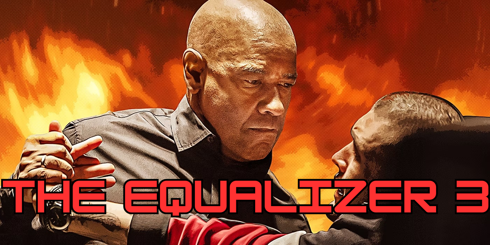

> _Be kind, for everyone you meet is fighting a great battle._ —Author unknown

Why do wise people urge compassion for evildoers? Are they being naïve? Or could it be that they see something that we don't?

---

The vast majority of what we do to "fight evil" is actually no such thing. It is the darkness in our minds _pretending_ to combat the darkness "out there." But darkness never _actually_ fights itself: it is only ever on its own team. 

Every one of us has had the experience of skirting our conscience before — behaving in a way that goes against our deepest values, but that we convince ourselves is okay. Part of us knows _perfectly well_ that what we are doing is wrong, but that knowledge is carefully shielded from conscious self-reflection: it is "kept dark."

Maybe we've helped ourselves to "a little extra" at the expense of a company, convinced that we're only harming its wealthy (and greedy) owners. Maybe it turns out that the owners weren't so wealthy after all, or that our behavior subtly harmed many other people indirectly. But our minds found an excuse for those too — or else blocked that knowledge entirely from conscious awareness, so as not to threaten our story of good and bad.

Or perhaps we were a little bit nasty to someone, convinced that they deserved it — having no deep insight into the true source of their misbehavior, and unable to admit that we just compounded their difficulties in life. We can't see that a tiny part of them was actually _trying_, and that our casual cruelty was the final straw. To hide this, we convince ourselves that _no_ part of them was trying; that they are _fundamentally morally defective,_ and thus beyond help. But it doesn't feel like we're _convincing_ ourselves; it simply feels like "the truth." We have no idea how good our minds are at crafting our reality to match our needs.

All the darkness in the world is intimately connected. Every act of unkindness propagates into the Whole, lowering the threshold for darkness to manifest elsewhere. Every act of self-deception makes it more likely that genuine atrocities will be committed by someone, somewhere — atrocities for which we will not only feel absolutely no complicity, but which will actually trigger _self-righteous outrage_, inciting us to compound the problem.

This is the secret mechanism by which evil spreads without anyone recognizing their role. Each one of us is only able to see the self-deception in others, provoking us to violently attack it, thereby reinforcing it while feeling flawlessly certain that we are "helping." It is an _impossibly_ clever trick. 

The reason that we cannot defeat evil is that we refuse to see its true nature. A deep part of us knows that to fully expose it "out there" would also expose it "in here" — and we are not ready for that just yet.

  

---

> _For so long as the root of wickedness is hidden, it is strong. But when it is recognized, it is dissolved. When it is revealed, it perishes. ... It is powerful because we have not recognized it._ — The Gospel of Philip

From a certain perspective, the darkness appears sentient; even intelligent. Yours triggers mine, which triggers yours, etc., almost as though they are _allied_. In fact, if you look closely, you'll see that your darkness and mine aren't truly separate: they behave more like appendages of a _distributed malevolent entity_, manipulating all of humanity from within the dark crevices of our own minds; the places where we dare not look.

It is what some cultures know as the _Devil_ — and it is as "real" as anything you can touch. It keeps our attention perpetually fixated outward, so that we never look too closely "in here" — the one place where we have direct power over it. Its greatest trick is to make you perceive other people's evil as being _intrinsic_ to their minds. **By agreeing to this misperception, you are choosing to enter your own shadow, where you won't see what you're really doing.** You become a beacon of darkness yourself. The more you do this, the more others will perceive _your_ evil as intrinsic — and the _less_ you will recognize it in yourself.

In more modern terms, it is the _evil global conspiracy_ — that secret cabal responsible for all the world's ills, yet whose full membership remains forever elusive. It is the _primordial_ evil conspiracy; the one to which all the rest owe their existence, and to which they ultimately filter up — and _we_ are its minions. All the conspiracies you can identify "out there" are rooted in this shared hidden aspect of mind. They feel "shadowy" because they are outer reflections of our collective unconscious. To believe that you have pinned it down externally is to fall into its most basic trap.

"The elites" may well be playing us off each other to take attention away from themselves — but the Devil is playing a _much_ bigger game; one in which even the elites are merely pawns. It controls our perception and models of reality so completely that we can hardly even fathom its existence. We feel that the dark state of our world must be due to individuals who are fundamentally unlike us, and whose violent elimination would therefore bring peace. It is astonishing that we never notice where these dark thoughts actually originate from, and what master they secretly serve.

---

> _And no wonder, for even Satan masquerades as an angel of light. So it is not strange that his ministers also masquerade as ministers of righteousness._ —2 Corinthians 11:14-16

Make no mistake: there are indeed people who have consciously invited in the Darkness in a way that we have not, and they _must_ be fought. But even in such cases, the evil is not _intrinsic_ — and perceiving it as such is always the same trap. It's not that they _don't know_ what they're doing. Of course they do — or rather, of course _part of them_ does, just like part of _us_ does. But the only way they can do it is that their self-deception is especially good at hiding it from conscious self-awareness — and also especially good at provoking us into violently attacking it in a way that will empower its true source; humanity's ultimate nemesis.

Hating them is thus _especially_ evil, in that it enables us to engage in much more profound self-deception than we otherwise could — and, by definition, be much less aware that we are doing so. When you look in their eyes and see "evil," what you are seeing is a place where society's dark activity has accumulated especially intensely — and a seductive invitation to pile on _more_ in a way that nobody can judge you for. Our culture's cumulative self-deception _necessitates_ their existence, and "benefits" from it, in that they serve the hidden purpose of drawing our attention away from the dark activity "in here."

That is why a part of our minds is so powerfully attracted to revenge fantasy films and the like. It is also why our political opponents dig in their heels when we mock and shame them: part of us _needs_ them to, so that we and they can continue to act as covers for each other's self-deception.

     
     
    <em>The Equalizer 3: EVEN MOAR EQUALIZERING!</em>

To be clear: self-deceptive violence _can_ suppress other people's darkness — at least, in public, and for a time. We can thus easily convince ourselves that it "worked" — but only because we choose not to look too closely at the full implications of our behavior. If you look closely enough, you will always be able to find the fingerprints of your own darkness imprinted on events distant in time and space; events that you normally feel absolutely no connection to, let alone any complicity for — indeed, the very places that trigger the most self-righteous outrage. But such perception is normally not available to us, unless we have done tremendous amounts of "inner work."

If all this is so, then what are we to do? Is there such a thing as fighting _without_ self-deception?

---

In truth, **the only weapon we have against the darkness is our Light.** You could also call it _compassion_ or _kindness_ — **and it has nothing to do with being nice.**

True compassion can be soft and gentle, or fierce and [even violent](https://www.snopes.com/fact-check/dalai-gun/), depending on what's required. It can look like mocking or shaming, and leverage _apparent_ contempt. But it arises from a very different aspect of mind, and has a radically different effect on all minds involved, both friend and foe. It contains not even a trace of malice or self-righteousness (though it can arise from an outrage that is free of those dark sentiments). Its profound integrity prevents the darkness in others from finding easy justification for itself.

Compassion is simply about being free of self-deception, so that our attempts to fight evil do not have the "unintended" consequence of creating more. From here, genuine contempt (for people) is impossible, because you clearly see the sense in which the Darkness is impersonal, despite people having _chosen_ it in some sense. It is always a trap — and now you see exactly how it works. This is hard to communicate, but we will try.

The secret purpose of contempt is to telegraph our own inner darkness to others while convincing us that we're doing no such thing. This subconsciously triggers their "evil detector," which makes them feel compelled to fight back. But since we don't know that we're doing this, we take this apparent recalcitrance as confirmation that _they_ are evil, which licenses escalation. Consciously, we act dismayed, but our darkness is secretly rejoicing. It is a kind of "secret handshake" between theirs and ours; one that you can learn to perceive.

All of this only works because part of us _knows_ that we're doing it, and part of them knows that we know, etc. — but at the same time, we both _don't_ know. It is our supposed inability to recognize this that makes it "dark" in the first place. 

**Evil is ultimately nothing but _the willingness to look away_ — not just from the darkness "out there," but from the darkness "in here."** But what is it that we're looking away _from_, exactly? To say that "evil is the willingness to look away from evil" would be circular.

---

There is a profound and astonishing sense in which we **are** everyone and everything. Realizing this in its entirety is known as _enlightenment_ (en-_Light_-enment), and is indeed a lofty goal — but all of us can sense it at all times, to one degree or another. It is why we sometimes thank other people for acts of kindness that don't benefit us directly. We intuit that what happens to any part ultimately happens to the whole. **You are the Light** — and so is everyone else. This may sound mystical or "woo woo," but it can be known directly and concretely. All self-deception — and thus all evil — ultimately boils down to our inability (or unwillingness) to see this.

Contempt is intrinsically self-deceptive: it is the pretense that we are _fundamentally better_ than others, which the deepest part of us knows is a sham — and which they can sense too, no matter how "evil" they are. It is the existence of this common knowledge (in the [technical sense](https://plato.stanford.edu/entries/common-knowledge/): _they know that we know that they know that..._) that permits evil to spread in the way described above. Ironically, evil ultimately depends on this fundamental unity.

Harming the world always ultimately harms us; looking down on people is looking down on ourselves; and forsaking them is secretly a desire to forsake ourselves, because we're not ready to come Home yet. That's all evil ultimately _is_. Until we see this, literally everything we do to "fight evil" secretly perpetuates it. It is only through compassion — freedom from self-deception — that we discover how to fight evil in a way that actually works.

**At its fiercest, the Light can look almost indistinguishable from the darkness — _almost._** It is precisely this difficulty in distinguishing "fierce kindness" from evil that allows the latter to take control — but part of you always knows.

This is the most humbling discovery: that part of us somehow always knew. We chose our agendas and ideologies over our kindness, telling ourselves that they were more "helpful," and believing it with such intense fervor that we really believed it. We felt that even if we had to face our conscience one day, we would be able to tell it with a straight face that we were doing our best. In one sense, we really were.  But part of us knew that we had no leg to stand on when looking down on others.

This is the most painful realization, but also the most liberating. We see that all that is required to redeem ourselves is to _choose to look_. Doing so even once, we see that we never truly _wanted_ to look away; that we never _could_ want such a thing — and that nobody else could either, if only they remembered. This is complete redemption.

How astonishing that a near-infinite amount of evil could spring from such an innocent mistake, echoing across (apparent) space and time. What a tragedy! We make a firm commitment to never forget — and to serve as a reminder to others when they do. We recall that this is why we are here in the first place.

This commitment ripples throughout reality, cultivating the ground for others to follow suit in their own time. **This is how the Light spreads.** It is the greatest gift we have to offer the world, and it doesn't require any special circumstances. Every moment is a fresh opportunity to _look_.

---

I wish I could leave you with some wisdom about real, practical ways to put this knowledge to use. Alas, such wisdom is the work of a lifetime, and I am a mere fledgling myself. All I know is that I wish to stop playing the confused game that we have inherited from time immemorial, and to remember why I am here. I only hope that you will offer your Light when I inevitably forget — and that it will be as fierce as necessary to help me remember.

Also see [quotes](../quotes.md).

---

> _Like many of you (I'm sure), psilocybin has changed the way I see this world, and the people around me. It has torn my heart open on many occasions and revealed to me how my actions effect other people in ways I would've never imagined. In addition, psilocybin has increased my ability to empathize with people to a degree I never thought possible._
>
> _I consider this a blessing, but it has also led me to a very troubling conclusion:_
>
> _The lack of compassion, empathy and love we (society) feel for each other is staggering. Especially between people who don't know each other. The more love and empathy I feel for others, the more aware I am of society's inability to feel it for each other._
>
> _Does this make sense? Does it mean this blessing is really a curse? Because sometimes, it feels that way._
>
> — A guy from [some online forum](https://web.archive.org/web/20150628081721/http://duncantrussell.com/forum/discussion/89/a-blessed-curse-psilocybinempathy/p1)

---

> *Nail on the head brother. My most recent mushroom trip (also the largest dose I've ever taken) I became fixated on a news story I had heard that week. About an 8 year old girl from a tribe in the Amazon, who was tied to a tree and burned alive in order to scare her people off their land so it could be logged. I realized that at the moment he did it, whoever lit that gasoline actually felt / thought more or less okay about what he was doing. **And my mind was illuminated with dozens of the parallels between that man's malformed, horrific perceptual / behavioral state, and mine. I saw the same mistakes in value attribution, the same willful ignorance of the consequences of my acts and words. And there was nothing I could do to deny the similarity.***
>
> *Reminds me of something (I think) Duncan [Trussell] said on some recent podcast, quoting somebody else: it isn't the victim of violence you have to pray for so much. It's the perpetrator. They are the one who is more trapped in delusion, more estranged from love, etc.*

[//]: # (All self-deception is ultimately rooted in this misperception. Defeating evil is therefore about healing it.)

[//]: # (This is a Love that excludes nothing and forsakes no-one — but also does not shy away from being fierce &#40;or even violent&#41; when the situation warrants it. This is true compassion, and it has nothing to do with being nice.)