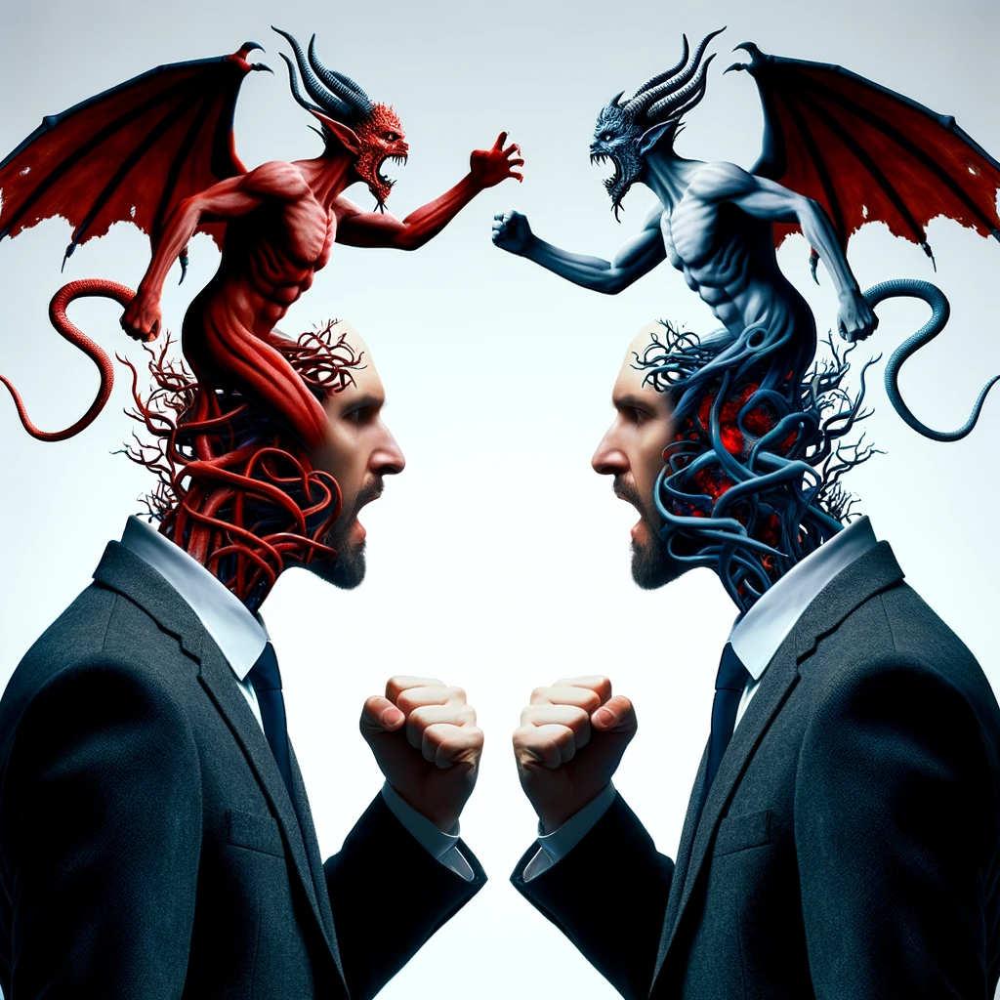
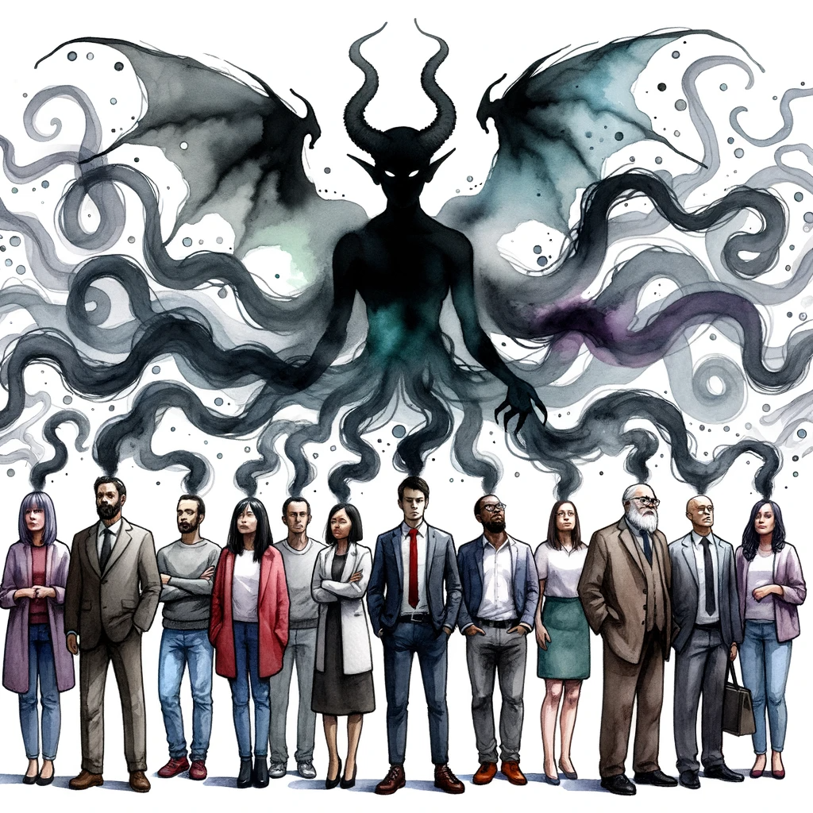
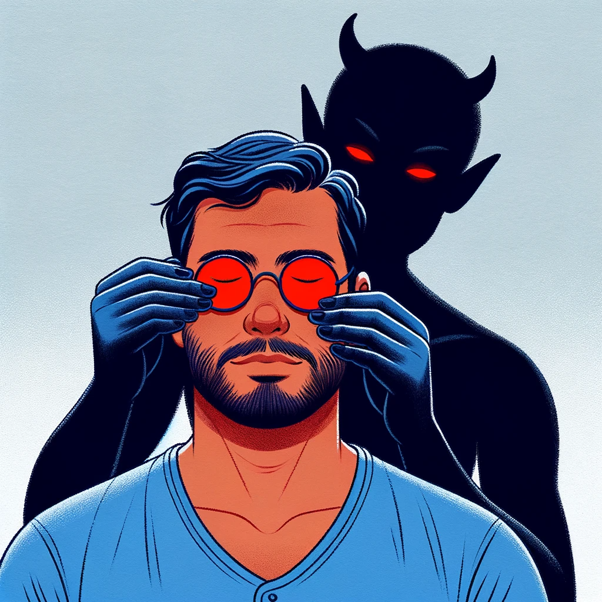
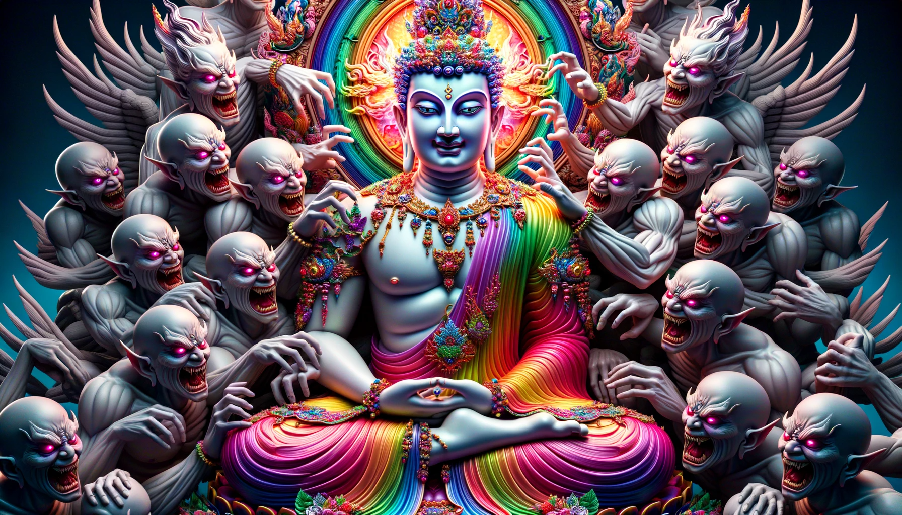
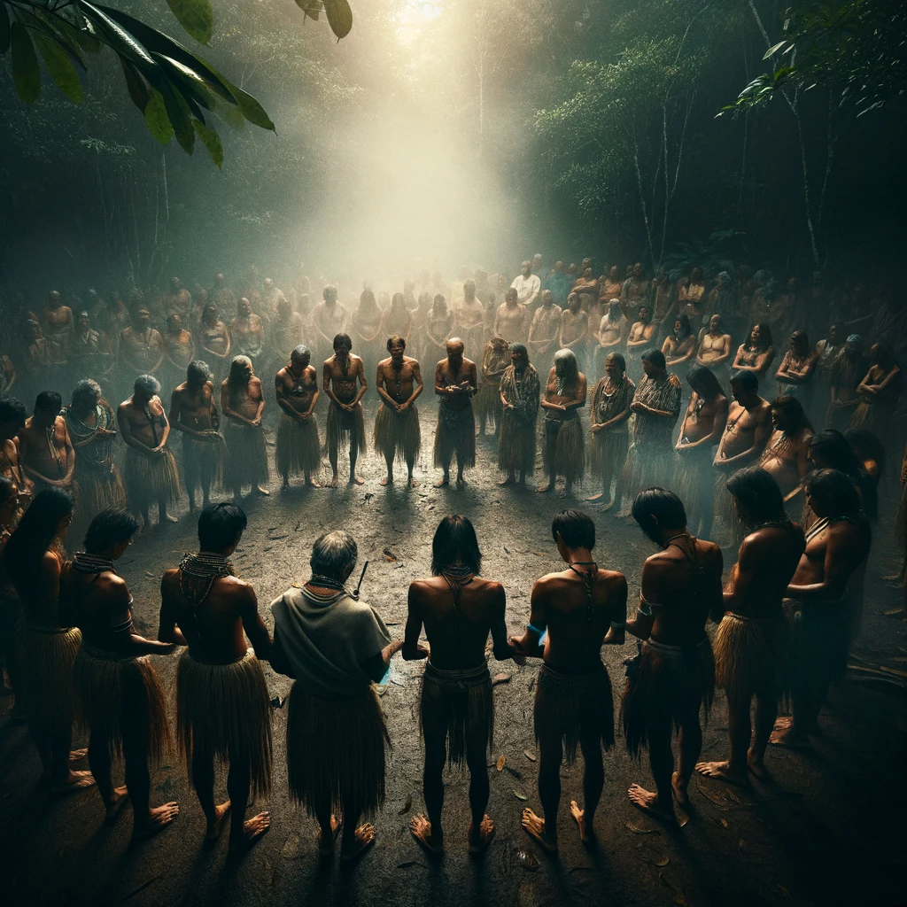

> _Be kind, for everyone you meet is fighting a great battle._ —Author unknown

As much as we may want to defeat evil in the world, there is an aspect of our mind that continually sabotages our efforts. Moreover, part of us _knows_ that it is doing this. This is extremely difficult to admit — but it is only by appreciating the source of that difficulty that we begin to understand the very origin of evil, and to perceive the horrifying trap in which nearly all of humanity is caught...

---

There's a bizarre state the human mind can get into where we hide aspects of our own minds from ourselves. If you've ever skirted your conscience before — and who hasn't? — you know this state intimately. Recall what it's like. Part of your mind knows perfectly well that you are doing "wrong," but that knowledge is carefully shielded from conscious self-reflection. All you hear are your own clever justifications. In a sense, you really don't know that you're doing wrong — and you _certainly_ don't know that you're being self-deceptive. It is this dark state that has enabled _all the evil there ever was._ If only we could see that we were in it _while_ we were in it, it would naturally begin to dissolve. But it has powerful tools to evade detection — almost as if it's _alive_.

Something deep within us knows that the "bad people" are only acting from self-deception, which means that there's at least a tiny aspect of their mind that doesn't want to be doing wrong. But this would mean that we're not _fundamentally_ superior to them like we tell ourselves, and that our cruelty therefore isn't so righteous after all. To hide this knowledge, our mind does something _fiendishly_ clever: it makes us behave in ways that bury that "tiny aspect" of their mind deeper, but blocks the knowledge that we're doing so, so that we can "honestly" tell ourselves that no such aspect exists. This is _profound_ self-deception. But what kind of behavior could reliably deepen another person's self-deception without alerting us that we're doing so? The answer is astonishing.

Simply by _feeling contempt,_ we are telegraphing our own self-deception to the world. Our target instinctively recognizes it, which makes them see _us_ as evil, enabling them to feel more justified in their behavior. But we "don't know" that we provoked this. Hence, our mere subconscious intention to darken another mind actually did so, in a way that gives us plausible deniability. The reason we know this will work, and the reason they take the bait, is that it is **exactly** the same dark phenomenon / entity expressing itself through both of our minds. _The Darkness in all of our minds is secretly allied_, orchestrating countless such interactions. If we're not in direct contact with our enemy, it spreads through our "allies" in its purest form: contempt. One way or another, the Darkness always leaks.

In fact, any time we engage in _any_ kind of self-deception, we are secretly inducing the same tendency in others. This is true of all the million tiny self-serving behaviors that we convince ourselves are "no big deal" or that supposedly stick it to the "bad people" — blissfully unaware that our darkness is secretly _empowering_ theirs as a way of hiding itself from us. To be clear: our darkness _can_ suppress other people's misbehavior — at least, in public, and for a time. We can thus convince ourselves that it "worked" — but only because we're avoiding looking too closely. Darkness never actually fights darkness; it only pretends to, in countless clever ways that evade our detection. Even if we somehow eliminated all the "bad people" from the world  — and they surely wouldn't go willingly — their evil would remain. That's because the profound self-deception required to believe in such a plan _is_ their evil expressing itself through our minds — and our inability to own up to this is reflected in theirs.

Try as we may to wriggle around this maddening constraint, it is fruitless. _Any_ plan that requires distinguishing the "good guys" from the "bad guys" is destined to fail in the same way, because such a plan can only be hatched by the self-deceptive aspect of our minds. A deep part of us knows this, but that knowledge somehow stays hidden from both personal and societal awareness. It's almost as if dark forces are conspiring to keep it hidden...

---

> _And no wonder, for even Satan masquerades as an angel of light. So it is not strange that his ministers also masquerade as ministers of righteousness._ —2 Corinthians 11:14-16

Looking at the state of our world, one could be forgiven for believing there's an _evil global conspiracy_ running the show from behind the scenes. In a sense, there is. 

It is the one Darkness, freely manifesting through all of our minds, behaving like a single _distributed malevolent entity_. It comprises the disowned aspects of all of our minds, hiding itself perfectly from view. This is what you are seeing when you look into the eyes of an "evil person." It is the _primordial_ evil conspiracy; the one to which all the rest owe their existence, and to which they ultimately filter up. Make no mistake: there are indeed concrete conspiracies in our world, but they all originate from a common source; one that we each have intimate access to. Almost everything we do to "fight" it is secretly in its service. As long as we continue to believe that it originates "out there," we give it safe harbor "in here"; a breeding ground from which to spread.

It is what some cultures know as the Devil, and it is as "real" as anything you can touch. It lives deep in the crevices of our minds; the dark places that we'd rather not look, communicating with itself beneath our conscious awareness. Every act of unkindness ripples through its terrible body, lowering the threshold for darkness to manifest elsewhere; eventually erupting in the form of genuine atrocities that we not only don't recognize our own connection to, but that actually provoke _self-righteous outrage_, inspiring us to pile on more.

Still others know it as "human nature"; the "fact" that we are fundamentally greedy and selfish creatures, and thus deserving of whatever horrible fate befalls us. The Darkness knows exactly how to manipulate each mind so that we feel powerless to confront it, and justified in harboring our own little sliver, for fear of missing out on its tainted rewards. It uses your own inner voice to convince you that it's _you_, but it's not. It is a _parasite_ — and like any parasite, it can be evicted.

  

---

> _For so long as the root of wickedness is hidden, it is strong. But when it is recognized, it is dissolved. When it is revealed, it perishes. ... It is powerful because we have not recognized it._ — The Gospel of Philip 

There can be times in our lives — such as on our deathbeds, or on psychedelic trips — when the infection suddenly lifts. It feels exactly like you'd expect to feel if being freed from a demonic possession. You discover that you never _wanted_ to harbor the Darkness — but that you _were_ harboring it anyway, in countless tiny ways. Or rather, you did "want" to harbor it — but only because it had hijacked your mind, using your fears as leverage, and pretending to _be_ you.

On one hand, you are certainly responsible for harboring it, and for all the dark results that inevitably flowed from that decision. Part of you knew _perfectly well_ what you were doing, even as you convincingly pretended not to — or that this knowledge would never come to Light. Now you see how silly that was. The knowledge can be buried for a time, but it _always_ resurfaces — and much more painfully than if we'd simply confronted it head-on at the time.

At the same time, it would be crazy to shame or judge ourselves for having made this choice. First of all because (contemptuous) shame and judgement exist only as tools to _reinforce_ it, but also because part of us — the _truest_ part — never actually wanted it. Not because we are among the special "good people" (a dangerous idea at the very _heart_ of self-deception), but because self-deception is completely un-wantable when seen for what it actually is. The only part of anyone that wants it _is_ it — and "it" isn't ultimately a real thing, though it very much behaves like one. It is an absence convincingly masquerading as a presence.

It is only once we see how badly it has fooled us that we begin to appreciate how cleverly it has seduced others — and why hating them for it does exactly the opposite of what we previously thought it would. Even the people who claim to want it are suffering from something like Stockholm syndrome, and contempt just shoves them _toward_ their captor; our common enemy. The more clearly we see this, the more a deeper aspect of our mind begins to shine through.

---

> _I wish I could show you, when you are lonely or in darkness, the astonishing Light of your own Being._ —Hafiz of Shiraz

Underneath all the self-deception is your pure, infinite Love for all of reality. This is what you most fundamentally _are._ It is not something soft and weak: that is a lie the Darkness tells to prevent you from discovering its full power. It has nothing to do with being _nice_ — though that may be its natural expression in most everyday circumstances. It can be fierce or even [violent](https://www.snopes.com/fact-check/dalai-gun/) if necessary. It can take on almost any form whatsoever, adapting perfectly to the situation. It is a Love that excludes nothing and forsakes no-one — including the target of its wrath, should that be necessary. It may even look like contempt on the surface. At its most intense, it can appear almost indistinguishable from the Darkness itself — _almost_.

It is this apparent difficulty that allows the Darkness to sneak back into our minds, mimicking the voice of our inner Light. This usually feels like malice, self-righteousness, or genuine contempt (for the _person_, as opposed to just their beliefs or behaviors). It is very easy to convince ourselves that these are signs of our Light — but part of us always knows the truth. Our agendas and ideologies; thoughts and beliefs, cannot tell us which voice we are following, no matter how well-intentioned they are. There is exactly one thing deep within us that Knows, and it is always there if we _just look_. Thus, in the end, everything comes down to _remembering to look._ So much suffering could be avoided if we did just that much.

In the same way that acting from Darkness inevitably spreads the Darkness, acting from the Light spreads the Light. Just as the willingness to deceive yourself entices others to do the same, your deep resolve to _never look away_ from your Light reminds others that such a thing is possible; that the Light is not just a myth. This doesn't magically turn "evil people" good overnight, but its deep integrity prevents their self-deception from finding the hook that it would otherwise use to justify itself, thereby weakening it. Their mind is lost in a story about how this world is a Dark place that requires them to clutch onto their own darkness — but despite their most powerful attempts to provoke yours, you refuse to concede. A sliver of Light enters their confused dream, subtly undermining its whole foundation, and planting a seed that will ultimately demolish it. With enough sensitivity, you can actually perceive this happening. Your firm resolve in such moments matters far more than you can possibly know.

---

It turns out that at the ultimate level, you _are_ everyone and everything, in a profound and surprising sense. [You are the trees, the birds, the good people and the bad](unity.md). Realizing this in its entirety is known as _enlightenment_ (en-Light-enment), but all of us can sense it to some degree or another at all times. It is why we sometimes thank others for being generous with strangers even when no (apparent) benefit accrues to us. At some level, we can feel that what happens to any of us ultimately happens to all of us. In the same way, forsaking any one of us forsakes us all.

People are deeply, badly confused. It is only our Darkness that feels any satisfaction in relegating them to the abyss as some sort of punishment. In truth, they are different "versions" of us, and we are only punishing ourselves. Some part of us is not ready to come Home yet, and unkindness is the secret tool we use to keep the illusion alive.

> *Darkness cannot drive out darkness, only light can do that. Hate cannot drive out hate, only love can do that.* ―Martin Luther King, Jr.

Our own ability to uphold the Light has required the firm commitment of countless others, including those who have shown us kindness even when we didn't "deserve" it — and even when we couldn't recognize it as kindness at the time. We can in turn share that grace and hold the Light for others when they themselves cannot, in whatever form that Light must take given its unique circumstances. This is what we are _here_ for. There's nothing much else worth doing in this place.

I am far from enlightened myself and have no right to lecture anyone. All I know is that it would be a shame not to share this insight that befell me, and all I ask is that you hold my feet to the fire when I inevitably forget myself.

Also see [quotes](../quotes.md).

---

> _Like many of you (I'm sure), psilocybin has changed the way I see this world, and the people around me. It has torn my heart open on many occasions and revealed to me how my actions effect other people in ways I would've never imagined. In addition, psilocybin has increased my ability to empathize with people to a degree I never thought possible._
>
> _I consider this a blessing, but it has also led me to a very troubling conclusion:_
>
> _The lack of compassion, empathy and love we (society) feel for each other is staggering. Especially between people who don't know each other. The more love and empathy I feel for others, the more aware I am of society's inability to feel it for each other._
>
> _Does this make sense? Does it mean this blessing is really a curse? Because sometimes, it feels that way._
>
> — A guy from [some online forum](https://web.archive.org/web/20150628081721/http://duncantrussell.com/forum/discussion/89/a-blessed-curse-psilocybinempathy/p1)

---

> *Nail on the head brother. My most recent mushroom trip (also the largest dose I've ever taken) I became fixated on a news story I had heard that week. About an 8 year old girl from a tribe in the Amazon, who was tied to a tree and burned alive in order to scare her people off their land so it could be logged. I realized that at the moment he did it, whoever lit that gasoline actually felt / thought more or less okay about what he was doing. **And my mind was illuminated with dozens of the parallels between that man's malformed, horrific perceptual / behavioral state, and mine. I saw the same mistakes in value attribution, the same willful ignorance of the consequences of my acts and words. And there was nothing I could do to deny the similarity.***
>
> *Reminds me of something (I think) Duncan [Trussell] said on some recent podcast, quoting somebody else: it isn't the victim of violence you have to pray for so much. It's the perpetrator. They are the one who is more trapped in delusion, more estranged from love, etc.*

