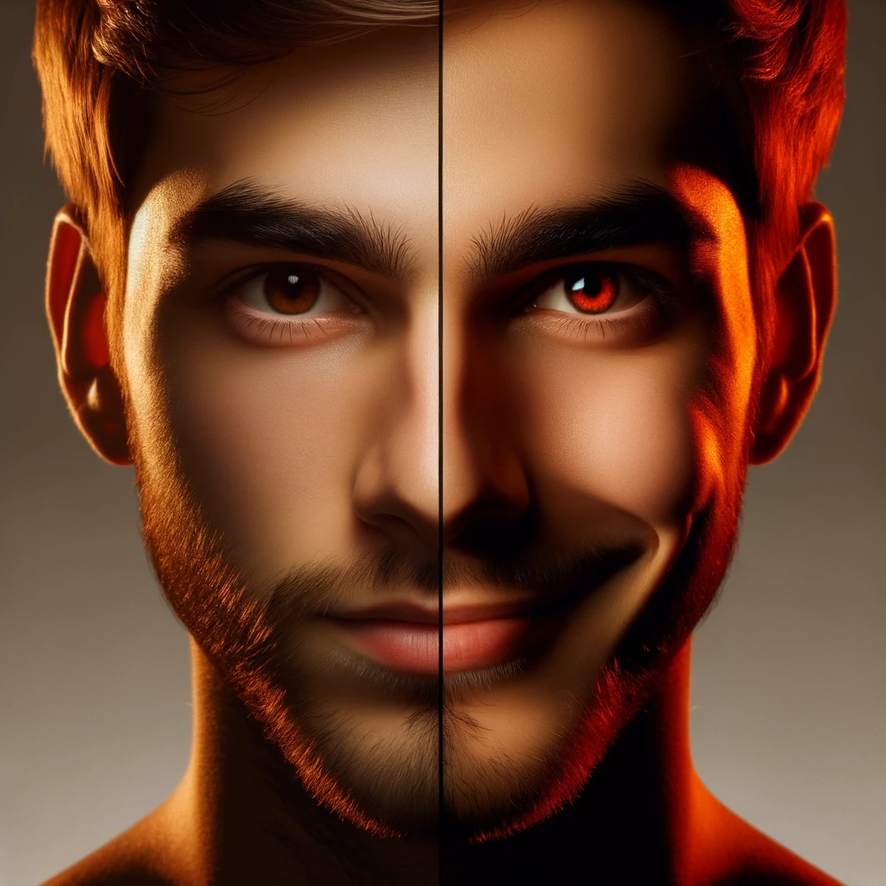
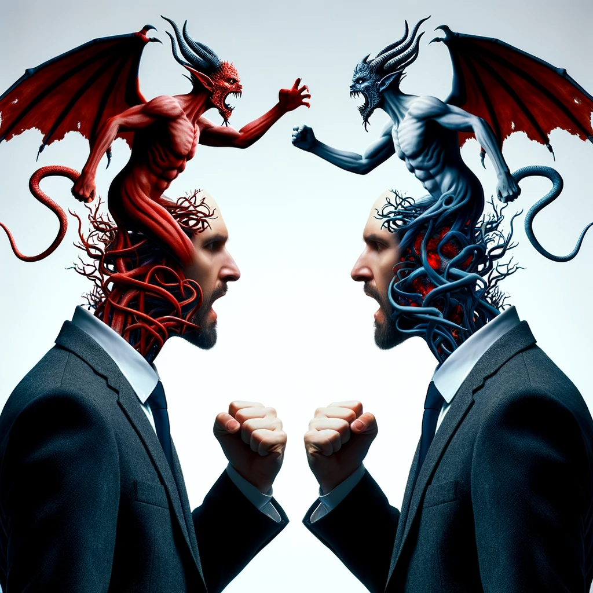
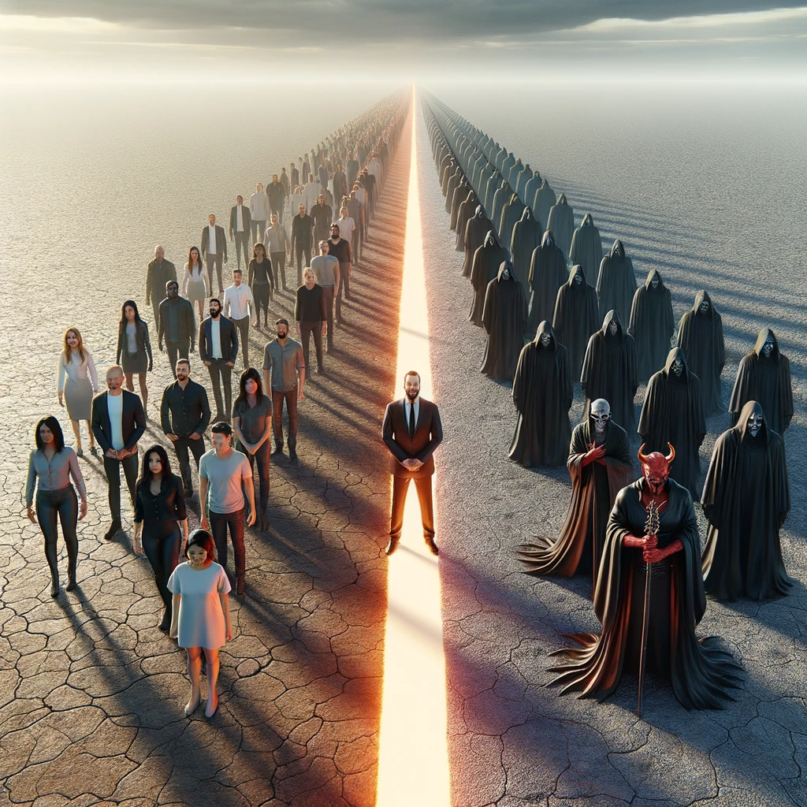
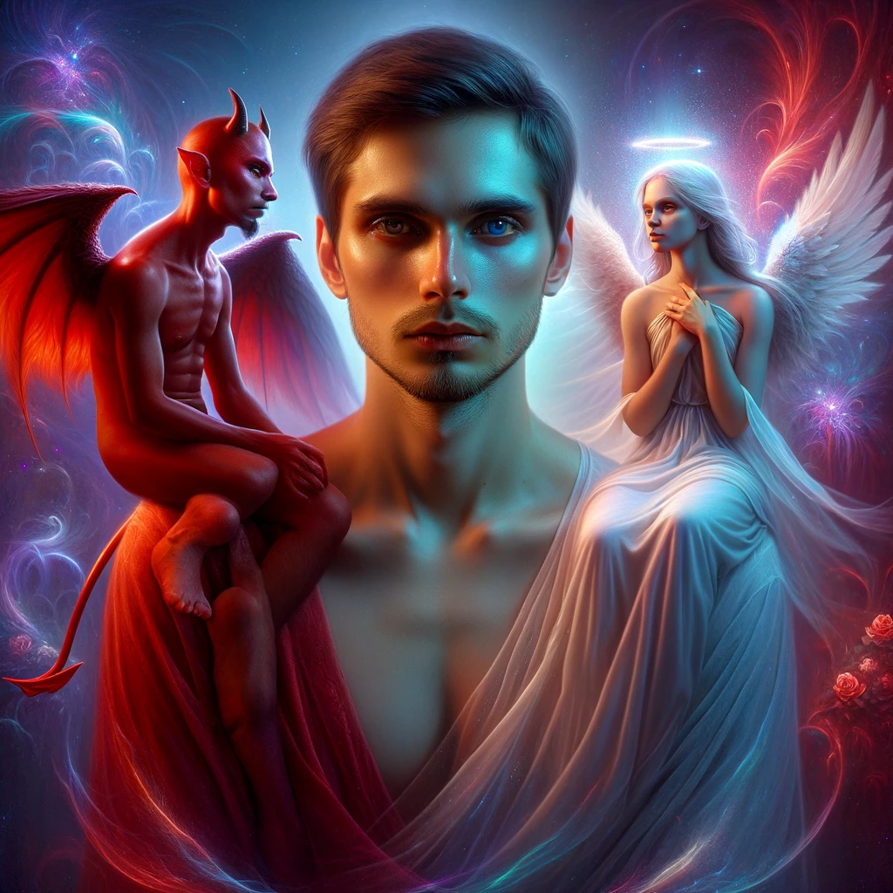
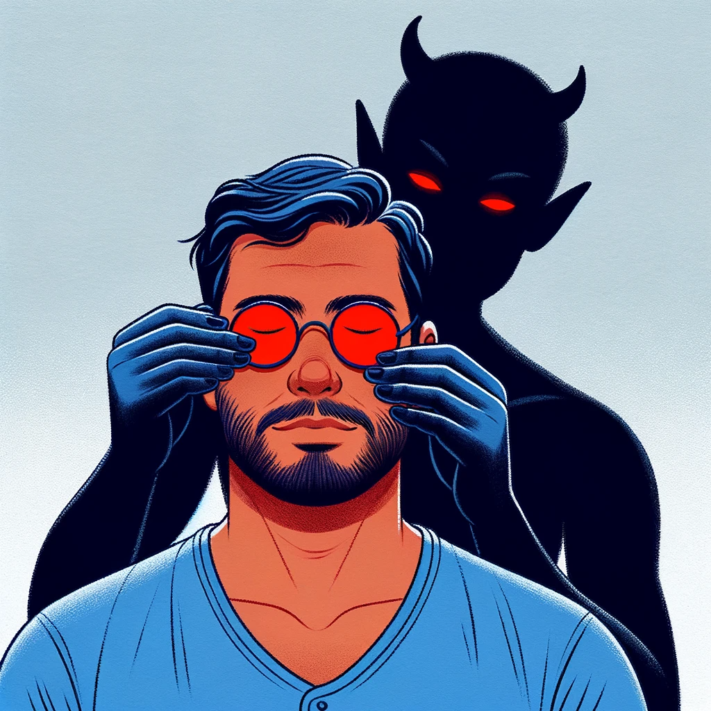
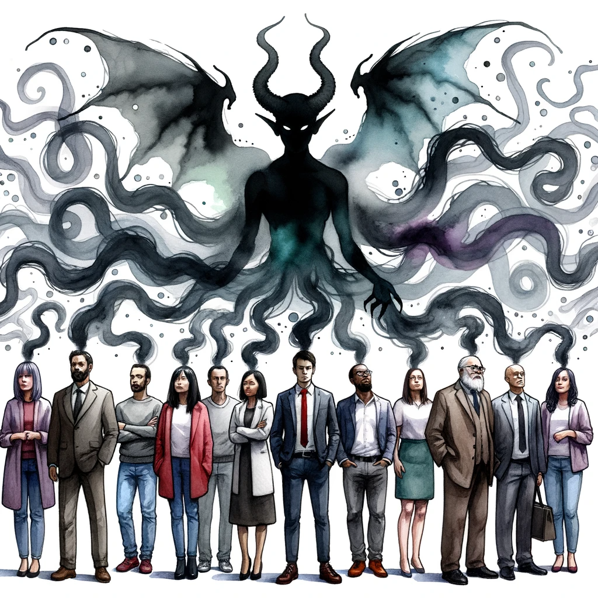
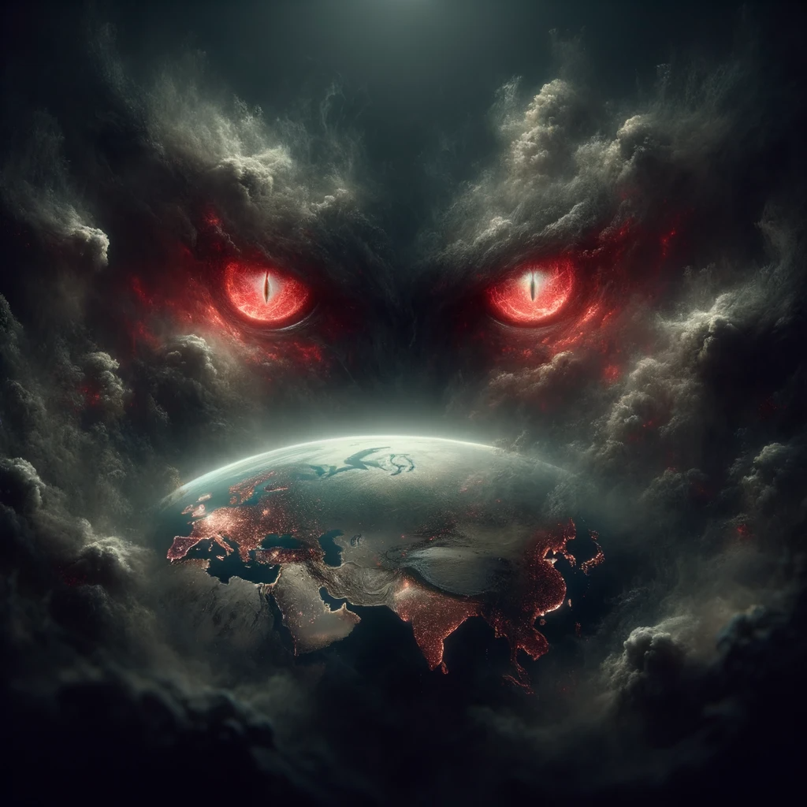
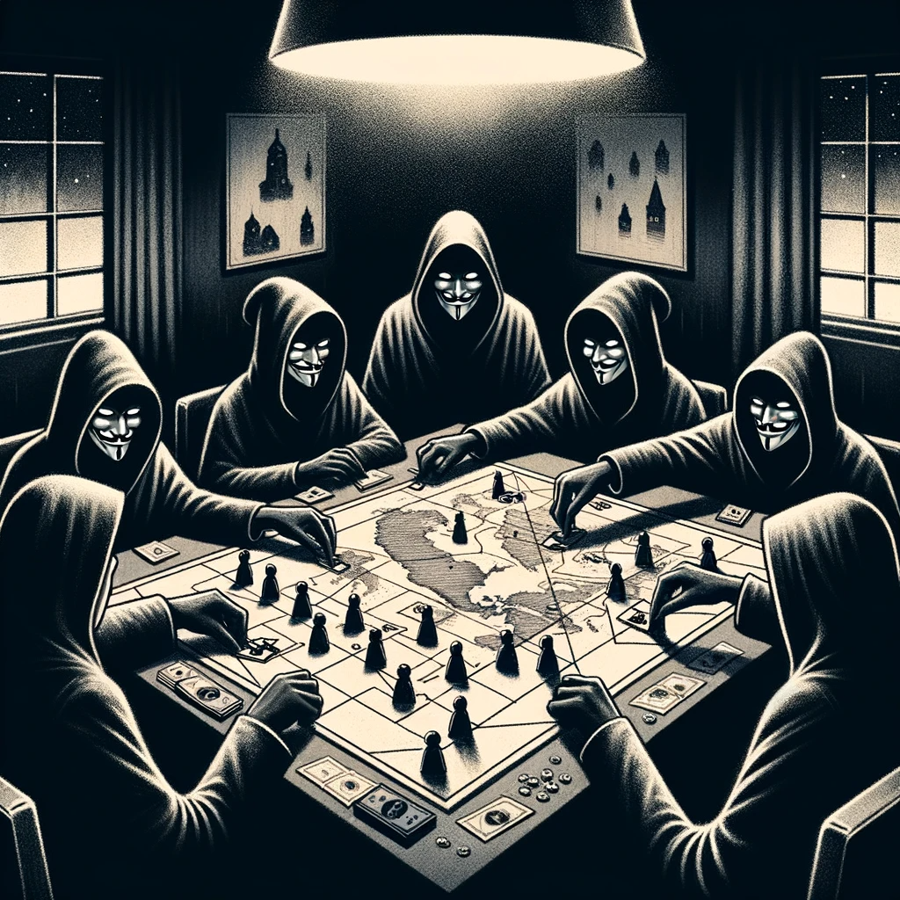
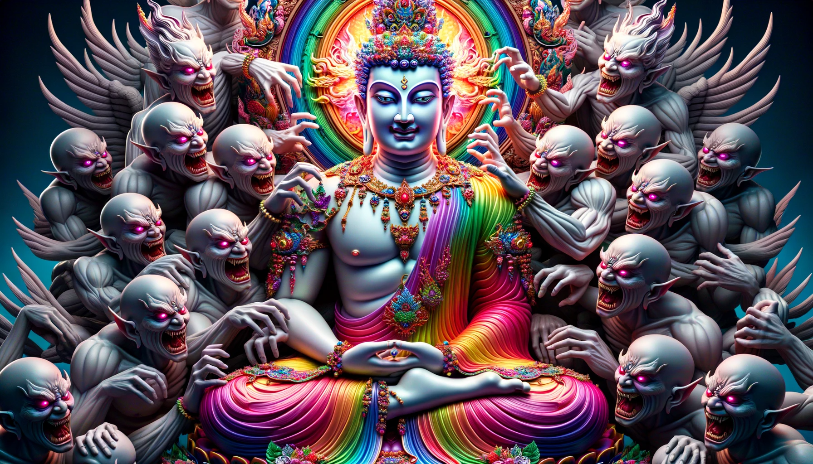

> _Be kind, for everyone you meet is fighting a great battle._ —Author unknown

> _For so long as the root of wickedness is hidden, it is strong. But when it is recognized, it is dissolved. When it is revealed, it perishes. ... It is powerful because we have not recognized it._ — The Gospel of Philip

The greatest trick the Devil ever pulled was to convince you that he doesn't exist _within your own mind_. He hides in the last place we'd ever look — and we are protecting him with everything we have.

---

Take a moment to reflect on what's wrong with the world, and bring to mind the people responsible. Don't they seem _fundamentally morally defective_? Do you feel contempt or maybe even malice? It feels like those emotions are there to help you _fight_ evil, but this is a sinister lie. They exist only to help you darken the world, even as you feel flawlessly convinced that you're helping.

This is not something I can convince you of, so I won't even try. But here's the thing: part of you already knows it. You don't enjoy mocking or shaming your enemies to help them (or anyone else) "see the light," or to make the world a better place. You do it to make yourself feel superior. It may temporarily suppress their misbehavior, but it _will_ increase the net hostility and polarization in the world. You may tell yourself that it won't, or that it's their fault if it does, or that the benefits outweigh the drawbacks, but part of you knows that these are just lame excuses for malicious behavior. This is true of _all_ forms of unkindness. This example is just one among countless.

This isn't an attack on you, though it may feel like one. That defensiveness is hiding something crucial — something that I promise you want to see. An aspect of your mind is actively preventing you from consciously acknowledging the effects of your words and actions. Why? 

Part of you _knows_ that darkness exists within you, and it does everything in its power to shield this horrifying truth from your conscious mind. It makes you actively seek out the evil in others, because viciously attacking theirs takes attention off of your own. Said another way: something within us _needs_ other people to be "bad," so that we can know ourselves as "good" by comparison. So we subconsciously do things that _provoke_ evil in others, and hide this from our conscious minds.

---

     

Think back to a time when you disobeyed your conscience, pretending either that you couldn't hear it or that you could safely ignore it. We've all done this. When this happens, a schism is created in your mind: part of you knows _perfectly well_ that you're doing wrong, but that knowledge is cleverly hidden from conscious self-reflection. It is then easy to convince others that you _don't_ know, because you have convinced _yourself_. **All evil relies on this mechanism of self-deception**.

Evil (almost) never _feels_ evil. That's the most terrifying thing. One day you wake up and discover that nearly everything you've been doing to "fight evil" has only been amplifying it — and worse, that **part of you always knew this, even as you pretended not to**. Until you see that this is going on within you (and clean it up), you have no hope of helping fix the evil "out there." You can only create more, while being supremely confident that you're fighting it.

The longer you let this condition fester, the more you must hide it from yourself, because the more you subconsciously recognize the horrifying (and increasing) similarity between what you're doing and what you're violently accusing others of doing. Very quickly you find yourself "in too deep" and completely unable to detect this, even when it is pointed out. In fact, when people _do_ point it out, your subconscious registers them as enemies, to "protect" you.

     

---

This is where the "bad people" find themselves. Something in them is shielding the _wrongness_ of their behavior from conscious self-reflection — and the more contemptuously you judge them for it, the more they will perceive _you_ as evil and dig in their heels. You will take this as confirmation of _their_ evil, but they are actually recognizing the same self-deceptive mechanism in you that is operating within them – the very thing you see as "evil." **This whole dance was choreographed: your darkness reveals itself to them while hiding it from you, and vice versa, so that you can both feel justified in escalating your violence while plausibly absolving yourselves.**

(The brilliance of this ruse is too amazing not to linger on for a moment. The only thing required to create new evil is to _appear evil_, because this triggers malice in others. But go ahead and _try_ to appear evil. You can't do it, can you? You know that you're faking it. Now give someone a dehumanizing glare. Put as much contempt and malice into it as you can. There — that feels evil, doesn't it? They can feel it too. Now all that remains is to hide from yourself that you're doing this. _Voilà_. This is how we create evil while feeling righteous about it.)

The reason that the "bad people" need to shield their misbehavior from consciousness is that _part of them doesn't want to be doing wrong._ This means that they are not _fundamentally_ defective. You don't have to take my word for it, but can actually learn to perceive this. If you manage to take your own self-deception mechanism offline for even a moment, it feels exactly like you'd imagine feeling if you were suddenly freed from a demonic possession. When it lifts, you see that the darkness is not intrinsic to any mind, but has very cleverly commandeered them.

Seeing this even once turns your whole world upside-down. We perceive evil as intrinsic only to justify our contempt, which in turn exists only to create more. We are hating people for their susceptibility to the world's most fiendish mind-virus — the one responsible for our very hatred.

To be fair, there does seem to be a tiny percentage of people who have invited the demon in, for whom the description "evil" really does capture something important. They pose a much greater challenge, because they are consciously aware of having done so. Being "kind" to them in the conventional sense can indeed be dangerous. And yet the very _deepest_ aspect of their mind does not want it. Again, it is only once you see exactly what "it" is that you understand why _nobody_ ultimately could. It is like a form of Stockholm syndrome. Contemptuous judgment is designed to drive them further into the clutches of their seductive captor, so that we may escalate our violence.

When we meet (or even hear about) such people, we often experience the overwhelming urge to hate them, but this is the ultimate trap. The more thoroughly the darkness has ensnared others, the more it behaves like a black hole, sucking away our own light. If we are not alert to this, we enter their dark space of mind, in which the deepest evil feels impossibly righteous. Don't fall for it.

How can you know if your self-deception mechanism has "gone offline"? You will clearly perceive your profound interconnectedness with the world. The "great battles" that others are facing will suddenly become obvious, as will your unfortunate role in those battles. Malice, contempt, and self-righteousness will be recognized as profoundly delusional. You will remember that you are not fundamentally better (or worse) than anyone, and that pretending you are just makes the world darker.

This perspective is not an altered state of mind, but something that is always there yet somehow curiously hidden. It is your deepest and most natural mode of knowing, which is how you will know that you can trust it.

---

You see that the root of the problem was the desire to be special; what the Buddhists call the _ego_. For those of us with a self-image as "good people," this manifests as the need to be _relatively_ good; i.e., good in comparison to others. This duality forces us to continually create "bad people" in all sorts of subtle ways that we can't consciously recognize. This process only comes to an end when we discover the _absolute_ good within.

This is something that we cannot take any credit for[^credit]. Instead, we can only feel profound gratitude for whatever grace allowed us to discover it, and heartbreak that it still remains so deeply hidden in others. The hardest part is watching the whole world being casually cruel to each other, unaware of which "team" they are secretly fighting for. It inspires a fierce determination to fight the "possession" that has captured people's minds, instead of deepening it like we've unwittingly been doing. We clearly see the face of our true nemesis for the first time.

This doesn't mean that you will suddenly become nice or lovey-dovey toward evildoers. You may still need to be fierce, or perhaps even violent[^dalai-lama-gun]. Mockery, shaming, or even _apparent_ contempt might still be useful. But it will be in the service of _freeing_ people from the darkness, not pushing them further in. It is a kind of "tough love," and feels _nothing_ like the self-righteous antagonism that we normally feel when "fighting evil." You are still "connected to your heart." **That is what is most crucial.** Others can sense the profoundly benevolent intent (even if only subconsciously), and it makes _all the difference in the world_.

In every interaction you have two options: to either encourage the Light in others, or to fight their darkness with yours. **Encouraging their Light has nothing to do with being _nice_**. It is about being completely unwilling to abandon your Light under _any circumstances_ — including the one that their darkness is presently testing you with. It is looking for a "hook" in your mind that it can use to justify itself — some sign that even you, the "good person," are weak to its seduction. If you refuse to abandon your integrity even then, it is as though the fierceness of your Light subjugates their darkness. Their subconscious remembers that the Light isn't just a myth. This happens even if you were forced to use violence, and even if they still consciously perceive you as an enemy.

This is authentic kindness (aka compassion). It is "radical" in that it contradicts our usual intuitions — that kindness requires being soft or weak, and that some people "deserve" it while others don't. It could never be the case that some people deserve to be shoved further into the abyss while others deserve to be freed from it.

     

I know it feels like some people don't _have_ an inner Light to encourage, but this is just an illusion that our darkness uses to get its foot in the door. By the time it has tricked us into dividing the world into fundamentally "good" and "bad" people — which feels like the most natural thing in the world — it has already infected the deepest aspect of our minds. Then, it can bide its time fostering conditions that will get us to commit unspeakable horror in the name of "good."[^genocide]

---

> _And no wonder, for even Satan masquerades as an angel of light._ —2 Corinthians 11:14

It is said that "the elites" are tricking us into hating each other to take attention off of themselves. Doesn't this make you hate them? But no matter how dastardly their plans, even they can't fathom the horror that lies at the end of these tracks. Could it be that there is something even more subtle and wicked that is tricking us into hating _them_, so that humanity as a whole never suspects what's really going on? Indeed there is.

     

You know the classic image of the angel and devil sitting on our shoulders? It's _almost_ accurate, except for two things. First, the angel isn't external to you, but represents your intrinsically compassionate nature. Second, the devil _is_ extrinsic; it is a kind of parasite. But it doesn't just whisper obviously-bad ideas in your ear; it alters your very perception and pretends to _be_ your inner angel.

     

It is this devil that tricks you into seeing other people as _fundamentally_ defective, instead of seeing that they are being manipulated by _their_ devils (which is something that your angel can always see). Our devils continually trigger each other — not because they are enemies, but _because they are allies_. Evil never actually fights evil; it only pretends to, to create more of itself.

In this way, our individual devils behave more like a single "distributed organism" — the _Devil_, if you will. It signals to itself through the vast network of human minds, leveraging our collective intelligence to produce horrifying outcomes that none of us claim to want, yet which are the inevitable result of our cumulative self-deception.

     

You know how people sometimes suspect that there's an "evil global conspiracy" lurking in the shadows, responsible for all the world's ills? They are not crazy. They are subconsciously sensing something genuine: there is an aspect of all of our minds communicating with itself beneath our conscious thresholds, shielding itself from discovery in _insanely_ clever ways. The closer we get to discovering it within, the more it tricks us into projecting it externally. There is always _someone_ whom we must violently defeat to finally end Evil. It never occurs to us that this misperception is the very source of the problem, and that it is the surest sign that we ourselves are infected.

     

This "dark entity" continually drives humanity toward various kinds of Armageddon: situations in which everyone is violently proving just how righteous they are. It is why the US is headed toward civil war without anyone suspecting their own complicity, and explains bitter [divorces](https://www.gottman.com/blog/this-one-thing-is-the-biggest-predictor-of-divorce/) in which each side feels like the exclusive victim / hero. Nearly the whole world is caught in its terrible sway, evil provoking "righteous" retribution at every turn, without anyone ever noticing the true source of it all.

This is not just a wacky theory, or just a metaphor. As best I can tell, everyone who introspects carefully enough eventually discovers this. Something within your very mind is conspiring with the darkness in others to produce a kind of Hell on Earth. Every time you feel contempt for _anyone_, your "devil" is reaching out to give theirs a kind of secret handshake; a sinister agreement to keep this world bound in darkness. I have used the word "subconscious" to describe this activity, but that's not quite accurate. **It is completely accessible to consciousness, if you know how to look.** It is something you are _doing._ [The Devil hides in the last place you would ever look](https://www.youtube.com/watch?v=gg8JYYyWSPg); the innermost chamber of your self-identity.

It is impossible to overstate the shock of discovering, for the first time, that you have _always_ been in on the "evil global conspiracy." It is terrifying, heartbreaking, and humbling all at once. Every single act of unkindness we've ever perpetrated has been in the service of the Beast, even when we told ourselves that it was noble. This includes not only being cruel to other people, but _all_ acts in which we skirt our conscience — such as when we "shave off a little extra" for ourselves at the expense of others, or take pleasure in others' suffering, or countless other "innocent" misbehaviors.

To be clear: there are surely groups of particularly "endarkened" people who conspire to cause great harm, but their existence and effectiveness rely heavily on something that all of us are secretly doing. **We must hold such people accountable** — but when we do it with contempt, we are reinforcing the very conditions that effectively _compel_ their existence. Such murky entities will continue to operate for as long as we each cherish the "right" to harbor a little darkness ourselves.

     

Ironically, we have no leg to stand on if we're still feeling self-righteous, because that is the surest sign that we are still under the demon's malevolent sway. This is precisely the opposite of what that emotion tells us — that the more we feel it, the more _free_ of evil we must surely be. It is actually impossible to fight evil from this place, because self-deception can only ever create more of itself.

Our true enemy is not other people, but the dark "entity" that has captured _all_ of our minds. By keeping our attention fixated perpetually outward, it ensures that we never introspect deeply enough to discover our own complicity in keeping it alive.

---

MLK once said:

> *Darkness cannot drive out darkness; only light can do that. Hate cannot drive out hate; only love can do that.*

These words are far wiser than we know. Ultimately, evil is not actually a _presence_ (like it seems), but an _absence_. The absence of what? Of the perception of the interconnectedness of all Life; of our fundamental equality with others. That this absence can behave so much like a presence — and an _intelligent_ one at that — is astonishing.

In a profound and surprising sense, [you _are_ the world](unity.md). Ultimately, all self-deception boils down to ignorance of this fact. This ignorance is not fully dispelled until _enlightenment_, but we can all sense it at all times. It is why certain literature speaks to us so loudly, and why we sometimes thank strangers for acts of charity that don't seem to benefit us directly. Part of us knows that what happens to the world ultimately happens to us. It is senseless to scorn people for not having realized this.

It is not possible to reduce the darkness in the world by withholding our own Light; by leveraging our contempt[^contempt], malice, hatred, etc. That is an insidious trap that we _must_ see through if humanity is to survive. Your Light is capable of accomplishing everything you think you need your darkness for, and much, much more — but there is a price that must be paid: you must give up the illusion of being special; one of the few "good people" fighting the hordes of evil. You must relinquish the sinister pleasure of watching harm come to your enemies. In brief, you must give up self-deception.

In exchange, you will discover the path toward the world you actually want in your deepest heart of hearts. It is well worth the price, and infinitely more.

> *The shadow is a moral problem that challenges the whole ego-personality, for no one can become conscious of the shadow without considerable moral effort. To become conscious of it involves recognizing the dark aspects of the personality as present and real. This act is the essential condition for any kind of self-knowledge.* —Carl Jung

> *Such a man knows that whatever is wrong in the world is also in himself, and if he only learns to deal with his own shadow, he has done something real for the world. He has succeeded in shouldering at least an infinitesimal part of the gigantic, unsolved problems of our day.* —Carl Jung

     

---

> _Like many of you (I'm sure), psilocybin has changed the way I see this world, and the people around me. It has torn my heart open on many occasions and revealed to me how my actions effect other people in ways I would've never imagined. In addition, psilocybin has increased my ability to empathize with people to a degree I never thought possible._
>
> _I consider this a blessing, but it has also led me to a very troubling conclusion:_
>
> _The lack of compassion, empathy and love we (society) feel for each other is staggering. Especially between people who don't know each other. The more love and empathy I feel for others, the more aware I am of society's inability to feel it for each other._
>
> _Does this make sense? Does it mean this blessing is really a curse? Because sometimes, it feels that way._
>
> — A guy from [some online forum](https://web.archive.org/web/20150628081721/http://duncantrussell.com/forum/discussion/89/a-blessed-curse-psilocybinempathy/p1)

---

> *Nail on the head brother. My most recent mushroom trip (also the largest dose I've ever taken) I became fixated on a news story I had heard that week. About an 8 year old girl from a tribe in the Amazon, who was tied to a tree and burned alive in order to scare her people off their land so it could be logged. I realized that at the moment he did it, whoever lit that gasoline actually felt / thought more or less okay about what he was doing. **And my mind was illuminated with dozens of the parallels between that man's malformed, horrific perceptual / behavioral state, and mine. I saw the same mistakes in value attribution, the same willful ignorance of the consequences of my acts and words. And there was nothing I could do to deny the similarity.***
>
> *Reminds me of something (I think) Duncan [Trussell] said on some recent podcast, quoting somebody else: it isn't the victim of violence you have to pray for so much. It's the perpetrator. They are the one who is more trapped in delusion, more estranged from love, etc.*
> 
> (From a response)

## Addendum

(TODO)

- Judgement, outrage
- Pseudo-kindness
- Wisdom vs kindness

[//]: # (We _want_ people to believe that they're fundamentally broken.)

[//]: # (The most important thing needed in making a better world is freeing people from self-deception. We think that the greatest challenge is differences in opinions, but that's not true.)

## Footnotes

[^contempt]: Specifically, we mean (genuine) contempt for *people*. Contempt for ideas or behaviors can actually be healthy, as perhaps can (apparent) contempt that is rooted in genuine compassion.

[^credit]: In fact, taking credit for it is one way to be sure that we haven't found "it."

[^dalai-lama-gun]: The Dalai Lama was once asked what you should do if a gunman is trying to shoot you and you have a gun. [He said "shoot back."](https://www.snopes.com/fact-check/dalai-gun/)

[^genocide]: This is how genocides happen. The Nazis referred to Jews as 'vermin,' and during the genocide in Rwanda, Tutsis were referred to as 'cockroaches.' This is a common pattern throughout history. Perhaps paradoxically, the only way to be sure that you'd never do such a thing is that you don't feel contempt for the people who have.
